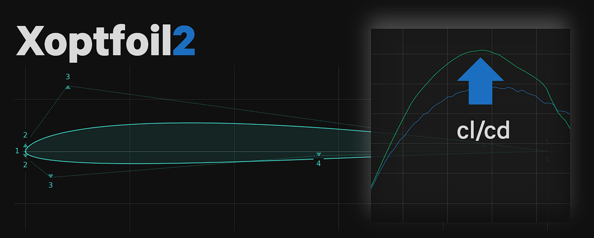

# Xoptfoil2 - The Airfoil Optimizer 

Optimize an airfoil based on its aerodynamic characteristics. 

Xoptfoil2 follows an airfoil design approach that can be described as 'design by polars', in contrast to classic methods such as 'inverse design' or 'direct design'.

A new optimized airfoil is defined by aerodynamic objectives at selected operating points. The optimizer then searches for an airfoil geometry that satisfies these objectives as closely as possible.

Xoptfoil2 is the successor of the awesome [Xoptfoil by Daniel Prosser](https://github.com/montagdude/Xoptfoil). The objectives of this project are:
- generate high-end airfoils with smooth, clean geometry ready for CAD use
- provide a CLI command-line tool for airfoil optimization
- serve as the optimization engine in [AirfoilEditor](https://github.com/jxjo/AirfoilEditor) with a graphical UI for airfoil optimization

Xoptfoil2 has been successfully used to develop the [JX airfoil families](https://github.com/jxjo/Airfoils) for F3B/F3F model gliders.


[Get started](https://jxjo.github.io/Xoptfoil2/docs/getting_started) and run your first airfoil optimizations.

---


## Main features

* Optimization using Particle Swarm Optimization
  - particle retry for invalid geometric designs
  - goal attainment balancing to handle diverse Pareto front objectives
* Aerodynamic evaluation based on Xfoil
  - retry of unconverged operating points
  - outlier detection of Xfoil results
* Available shape functions
  - Bezier curves
  - Hicks Henne bump functions
  - B-Spline curves (not for production)
* Definition of an optimization task with operating points by
  - min cd, max cl/cd, max cl, min sink
  - target values for cd, cl/cd, cm, cp_min
  - flap angle or flap angle optimization
* Geometry targets for thickness and camber
* Geometry and curvature constraints
* Curvature control
  - control curvature reversals for rear-loaded or reflexed airfoils
  - bump detection and suppression
  - max curvature at trailing edge
* Rerun optimization with refined targets
* Worker tool for automation of typical tasks 


## Documentation

For detailed usage and background information on airfoil optimization, visit the [Xoptfoil2 documentation](https://jxjo.github.io/Xoptfoil2).

## UI - AirfoilEditor

The [AirfoilEditor](https://github.com/jxjo/AirfoilEditor) provides a visual interface for airfoil optimization using Xoptfoil2 as its engine.

In the Optimization Mode of AirfoilEditor, you can:
- define optimization cases equivalent to Xoptfoil2 input files
- graphically define operating points directly in the polar diagram
- execute optimizations with Xoptfoil2 running in the background


## Installation

The current version of Xoptfoil2 is available in the [Releases section](https://github.com/jxjo/Xoptfoil2/releases) of this repository. The assets include zip files for:
- a ready-built version for Windows
- the source files for building Xoptfoil2 under Linux

For full installation details (including Linux system-wide install options), see the documentation: [Installation guide](https://jxjo.github.io/Xoptfoil2/docs/run_xoptfoil2/install).

#### Windows

Download the Windows zip file and extract it into any directory, for example directly on the Desktop for a first try. Xoptfoil2 is a lightweight installation and does not install other artifacts on your PC.

#### Linux (Debian-based)

Download the `Source Code` tar file and extract it in any folder. In addition to the standard development tools of a typical Linux distribution, the Fortran compiler and CMake are required. These tools can be installed with:

```
sudo apt install gfortran
sudo apt install cmake
```

In the project root, run the `build_linux.sh` script:

```
bash build_linux.sh
```

This builds and installs Xoptfoil2 to the default local path `linux/bin`.


#### CMake build (Windows and Linux)

Independent of helper scripts, the standard CMake workflow is:

```
cmake -S . -B build
cmake --build build
cmake --build build --target install
```

To override the default install location:

```
cmake -S . -B build -DCMAKE_INSTALL_PREFIX=<your_path>
```

The embedded binary version is defined centrally in the root `VERSION` file. For ad-hoc builds, it can be overridden during configuration with `-DXOPTFOIL_VERSION_STRING=<value>`.


#### Platform-specific defaults

- Windows default install location: `windows/bin`
- Linux default install location: `linux/bin`


## Examples

There are a few ready-to-run examples in the `examples` folder. The SD7003 airfoil example is a good starting point. Simply run `make.bat` on Windows or `make.sh` on Linux to start the optimization.

More detailed information about the example is available in the [Xoptfoil2 documentation](https://jxjo.github.io/Xoptfoil2).

### Changelog

See [CHANGELOG.md](CHANGELOG.md) for the history of changes.

### Have fun!

:+1:

Jochen Guenzel
