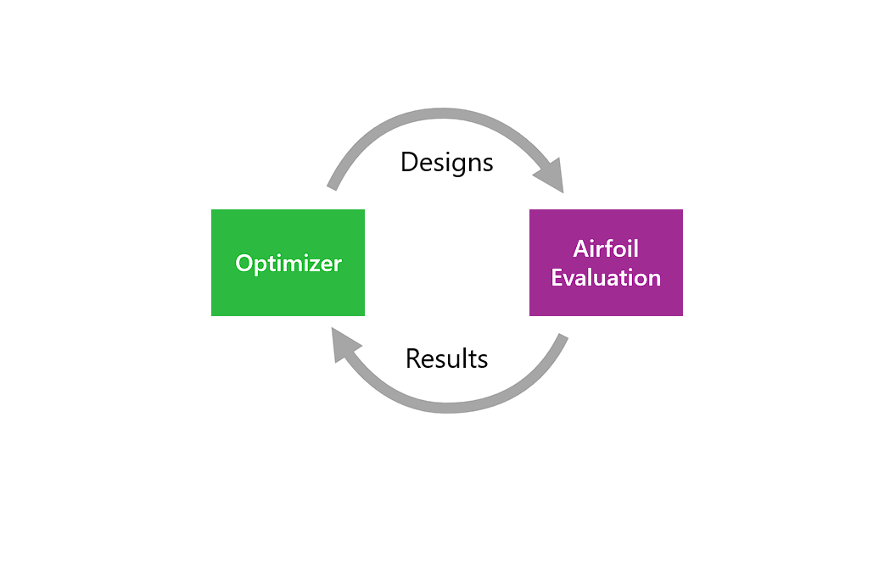
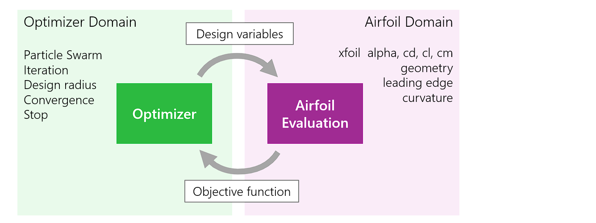
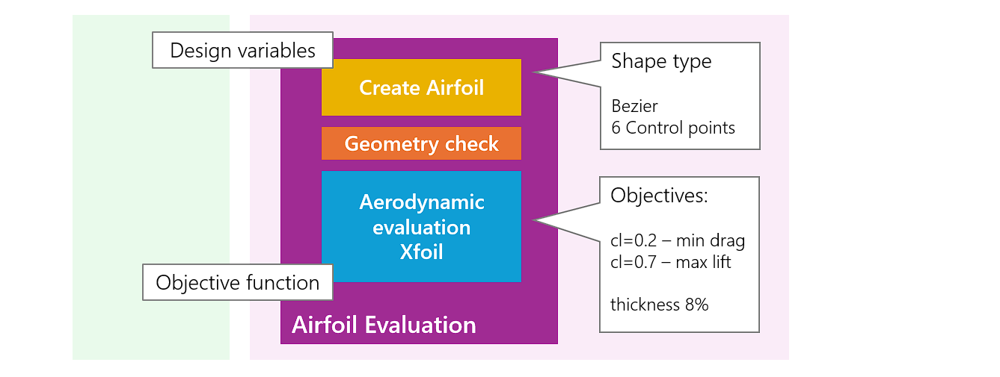
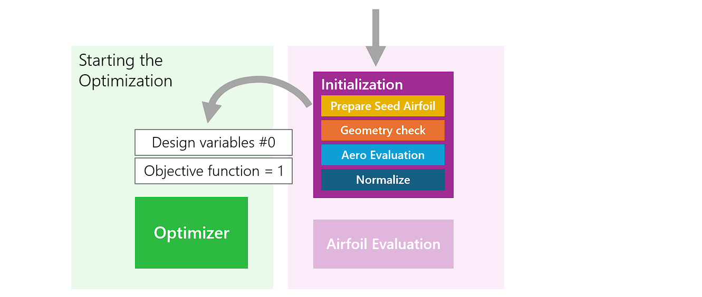

# Basics of Optimization  
{: .no_toc }
The basics of airfoil optimization will be explained in this short introduction. In doing so, we will take a targeted approach to the ‘objective function’ - the core of an optimization task.
{: .fs-6 .fw-300 }


## Table of contents
{: .no_toc .text-delta }

1. TOC
{:toc}

---

## Basic Principle

The basic principle of airfoil optimization is very simple. An 'optimizer' generates an airfoil design, it is examined whether this design has better properties in the sense of our target, if yes, it is further improved in this direction, if no, something new is tried. 



This interplay is repeated until no further improvement can be achieved.


## Optimizing Domains – The Objective Function

In the sense of ‘Separation of Concern’, it makes sense to divide the overall task into two separate domains. 

The optimization algorithm, such as ‘Particle Swarm Optimization’, is implemented in the optimizer domain. This is where the iterations are controlled, or the achievement of an end condition is checked. The optimiser domain has no knowledge of an airfoil or its aerodynamic properties. 

In the ‘airfoil domain’, an airfoil design is evaluated according to the formulated optimisation goals. New airfoils are created, the geometry is checked and an aerodynamic calculation is carried out with Xfoil. For its part, the airfoil domain does not know that it is running within an optimization - it is only responsible for the evaluation.



The connection or interface between the two domains is very narrow: 

The optimizer passes a set of **Design variables** to the ‘Airfoil Evaluation’. In the case of Xoptfoil2, these variables are normalized between 0 and 1. 

As a result of the evaluation, a number is returned - the famous **Objective Function**.

For the initial airfoil, the 'Objective Function' is exactly equal to 1.0. A better airfoil in terms of the objectives has a value of less than 1.0 - a worse design has a value greater than 1.0 

The 'Objective Function' is the only information that the optimizer has available to find the best design.  It's a bit like the children's game 'Hot, cold' where the optimizer only has this one piece of information as a clue in which direction to improve the design variables 
*(...that is still amazing to me...)*


## Create Shape and Evaluate 

Let's take a closer look at the 'Airfoil Evaluation' module. 



In a first processing step, "Create Airfoil" contains the instructions on how to rebuild an airfoil from the 'Design variables' with the help of a 'Shape function'. The 'Shape function' can be a Bezier curve, for example, which is defined by its control points which are mapped from the 'Design variables'. 

The newly created airfoil then undergoes a geometry check in which designs that make no sense or violate geometric constraints are discarded. In this case, the optimizer is informed via a high value of the 'Objective Function': "That was nothing!"

After a successful geometric check, the actual aerodynamic evaluation is carried out on the basis of an Xfoil calculation at the operating points of our optimization task. The individual results are added up to the final value of the 'Objective Function'.     

A special feature of Xoptfoil2 is the ability to include geometric values such as thickness and camber in the evaluation and thus optimize an airfoil with regard to these values. 

Finally the evaluated value is passed back to the 'Optimizer'.


## Prepare and Initialize 

Now that we have learned how an optimization loop works, one interesting question remains: "How does an optimization actually begin?"

Let's take a closer look at initialization step of an optimization. 



An airfoil whose properties are to be improved was specified as the starting point for the optimization. This so called 'seed airfoil' is first normalized and brought to the specified number of panels - see [Geometry of an Airfoil]() for details. 

The 'seed airfoil' is then subjected to the same geometry checks that are later performed on a new airfoil design during optimization. If this check is not successful, program execution is stopped.

The aerodynamic properties of the 'seed airfoil' can now be determined. The results are used to normalize the 'Objective Function' to the value 1.0 being the 'seed airfoil'. 

At the end of the initialization, the values of the 'Design variables' are calculated, which would result in exactly this 'seed airfoil' with the selected 'Shape function'. 

This set of 'Design variables' and the 'Objective function' with the value 1.0 are now passed to the optimizer as the start value of design #0. The optimization loop can start.     


{: .tip }
Using option `show_details` the individual steps of initialization can be followed nicely on the screen. 

## Particle Swarm Optimization 

Finally, let's take a look at the heart of the optimizer.
Optimization algorithms are a separate field of research with countless, very different approaches to finding the 'optimum' in n-dimensional solution space, spanned by the 'design variables'.

In Xoptfoil2 the so-called 'Particle Swarm Optimization' - PSO for short - is implemented.

The basic principles of 'Particle Swarm Optimization' are very simple:
- A swarm consists of typically 20, 30 so-called particles
- The particles start at a random position with a random velocity into the solution space spanned by the 'design variables' 
- All particles have their design tested by the 'airfoil evaluation' to get the objective function of its design
- In the next round, the new direction and velocity (resulting in a new set of design variables) is determined by ...

The 'swarm rule': 

- Maintain the last direction with a certain amount of inertia
- Orientate yourself with a random share to your best result so far
- Orientate yourself with a random share to the best of the swarm

This simple set of 3 rules leads to an extremely powerful, common search for the optimum in an n-dimensional solution space. Typically, 50-500 iteration rounds are sufficient to find a solution in an 'airfoil optimization'.


Particle swarm in a 2-dimensional solution space  - (c) Ephramac, CC BY-SA 4.0 via Wikimedia Commons
{: .fs-2}

A good introduction to more detailed information can be [found on Wikipedia](https://en.wikipedia.org/wiki/Particle_swarm_optimization#Accelerated_Particle_Swarm_Optimization).


### Local minimum 

It can sometimes happen that the particle swarm ends its search prematurely because it thinks it has found the optimum. However, this is only a local optimum, whereas the global optimum would be found two valleys further back, figuratively speaking. The risk of getting stuck in a local optimum depends on several factors. It is always advisable to repeat an optimization and check whether it leads to (almost) the same results.

### More particles or more iterations?  
Increasing the size of the particle swarm team (option `pop`) increases the probability that a particle will find a new best result, but at the same time the computing time per iteration increases roughly in proportion to the number of particles. 

At the same time, iterations are important and necessary so that the particles can 'learn' from each other. 

### Input Options

Normally no input parameters are needed for the particle swarm optimization as the defaults delivered good results in many optimization runs with quite different optimization tasks.

```fortran
&particle_swarm_options                          ! options for particle swarm optimization - PSO
  pop              = 30                          ! swarm population - no of particles 
  min_radius       = 0.001                       ! design radius when optimization shall be finished
  max_iterations   = 500                         ! max no of iterations 
  max_retries      = 3                           ! no of particle retries for geometry violations
  max_speed        = 0.1                         ! max speed of a particle in solution space 0..1 
  init_attempts    = 1000                        ! no of tries to get initial, valid design 
  convergence_profile = 'exhaustive'             ! either 'exhaustive' or 'quick' or 'quick_camb_thick'
/
```

| Option             | Description                               |
|:-------------------|:------------------------------------------|
|  `pop`             | Swarm population equals no of particles. You may decrease 10 or increase to 50 to see the difference in your optimization tasks  |
|  `min_radius`      | Defines the 'end condition' for the optimization. The `min_radius` is a measure how much the designs of all particles differ from each other. When all the particles end up snuggling up to the best aprticle, it's time to end  |
|  `max_iterations`  | The second possible 'end condition'. If you notice there is no improvement after many iterations you can reduce max_iterations to get a shorter cycle to the next run.|
| `max_retry`        | If a particle creates a design which leads to a geometry violation, it may have another try - otherwise this iteration round would be lost for this particle.|
| `max_speed`        | The maximum speed a particle 'flies around' in the solution space ranging 0..1. A higher speed can minimize the probability of stucking in 'local minima' but may also increase time until the particles reach convergence. |
| `init_attempts`    | No of attempts made during initialization to find a valid, random start position. There is normally no need to change. |
| `convergence_profile` | Defines a set of the 3 particle swarm parameters 'intertial', 'cognitive' and 'social'. The `quick` profile leads to fast results with a higher risk of not finding the global optimum. Give it a try in your specific use case. |


