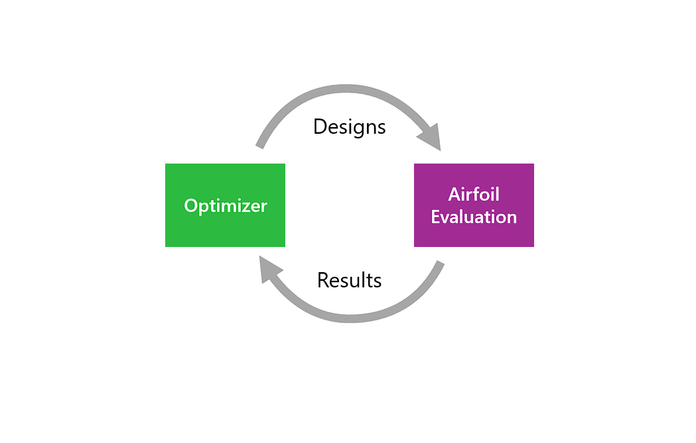
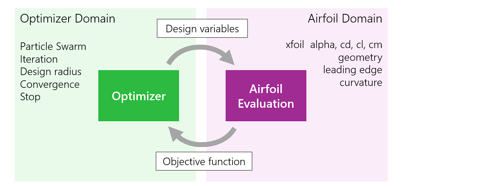
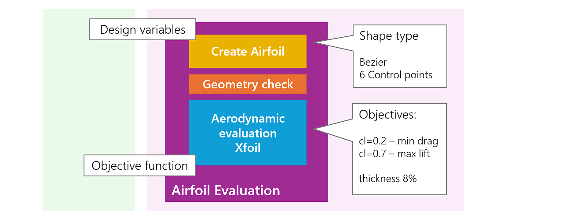
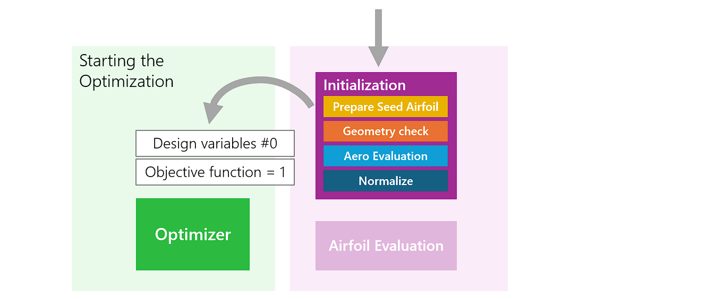

# Basics of Optimization
{: .no_toc }
This chapter gives a compact introduction to airfoil optimization in Xoptfoil2, with focus on the objective function as the core of an optimization task.
{: .fs-6 .fw-300 }


## Table of contents
{: .no_toc .text-delta }

1. TOC
{:toc}

---

## Basic Principle

The basic principle of airfoil optimization is simple: an optimizer generates a design, the design is evaluated against the objective, and then the search continues in a promising direction or explores a different one.



This interplay is repeated until no further improvement can be achieved.


## Optimizing Domains – The Objective Function

Following the principle of separation of concerns, it helps to split the task into two domains.

The optimization algorithm, such as particle swarm optimization (PSO), is implemented in the optimizer domain. This is where iterations are controlled and end conditions are checked. The optimizer domain has no knowledge of airfoil physics.

In the airfoil domain, a design is evaluated against the defined goals. New airfoils are created, geometry is checked, and aerodynamic analysis is run with Xfoil. In turn, the airfoil domain does not need to know anything about the optimization algorithm.



The interface between these domains is intentionally narrow:

The optimizer passes a set of design variables to airfoil evaluation. In Xoptfoil2, these variables are normalized to the range 0..1.

The evaluation returns exactly one number: the objective function.

For the seed airfoil, the objective function is exactly 1.0. A better design has a value below 1.0, while a worse design has a value above 1.0.

The objective function is the only feedback signal the optimizer receives. It is similar to the game "hot/cold": each new value indicates whether the latest move was better or worse.


## Create Shape and Evaluate 

Let us take a closer look at the airfoil evaluation module.



In the first step, "Create Airfoil" rebuilds geometry from the design variables using a selected shape function. For example, a Bezier shape function maps design variables to Bezier control points.

The generated airfoil then passes through geometry checks. Designs that are invalid or violate constraints are rejected by returning a high objective-function value.

After a successful geometry check, aerodynamic evaluation is performed with Xfoil at the requested operating points. The individual contributions are then combined into the final objective-function value.

A key feature of Xoptfoil2 is that geometric metrics such as thickness and camber can be included directly in the evaluation.

Finally, the objective-function value is passed back to the optimizer.


## Prepare and Initialize 

Now that the optimization loop is clear, one question remains: how does a run begin?

Let us look at the initialization step.



The starting point is a seed airfoil whose performance should be improved. This seed is first normalized and repaneled to the requested panel count; see [Geometry of an Airfoil]() for details.

The 'seed airfoil' is then subjected to the same geometry checks that are later performed on a new airfoil design during optimization. If this check is not successful, program execution is stopped.

The aerodynamic properties of the seed airfoil are then evaluated. These results define the reference baseline for all subsequent objective-function comparisons.

At the end of initialization, design-variable values are computed that reproduce this same seed using the selected shape function.

The preparation step always includes a Bezier matching pass for `.dat` seed files so the optimizer starts from a clean, well-defined geometry.

This initial design-variable set, together with objective-function value 1.0, becomes design #0 and the optimization loop starts.


{: .tip }
Using option `show_details` the individual steps of initialization can be followed nicely on the screen. 

## Particle Swarm Optimization 

Finally, let us look at the heart of the optimizer.
Optimization algorithms are a broad field with many ways to find an optimum in the n-dimensional space spanned by design variables.

Xoptfoil2 uses particle swarm optimization (PSO).

The basic PSO mechanics are straightforward:
- A swarm typically contains 20 to 30 particles.
- Particles start with random position and velocity in design-variable space.
- Each particle is evaluated by the airfoil-evaluation pipeline.
- In the next iteration, each particle updates direction and speed based on swarm rules.

The swarm rules are:

- Keep part of the previous direction (inertia).
- Move partly toward the particle's own best result.
- Move partly toward the best result found by the swarm.

This simple rule set creates an effective cooperative search in high-dimensional space. In airfoil optimization, 50 to 500 iterations are often sufficient to find a strong solution.


Particle swarm in a 2-dimensional solution space - (c) Ephramac, CC BY-SA 4.0 via Wikimedia Commons
{: .fs-2}

A good introduction to more detailed information can be [found on Wikipedia](https://en.wikipedia.org/wiki/Particle_swarm_optimization#Accelerated_Particle_Swarm_Optimization).


### Local minimum 

It can happen that the swarm converges to a local optimum, while a better global optimum still exists elsewhere in the search space. The risk depends on the optimization setup and objective landscape. It is good practice to repeat a run and compare whether results are reproducible.

### More particles or more iterations?  
Increasing swarm size (`pop`) increases the chance of finding better regions, but iteration cost also grows roughly in proportion to particle count.

At the same time, enough iterations are required so particles can exchange information and converge.

For target-handling details (goal attainment and `allow_improved_target`), see [Optimization Task]().

### Input Options

Usually, no PSO parameter changes are required. The defaults are intended to work well across a broad range of optimization tasks.

```fortran
&particle_swarm_options                          ! options for particle swarm optimization - PSO
  pop              = 30                          ! swarm population - no of particles 
  min_radius       = 0.001                       ! design radius when optimization shall be finished
  max_iterations   = 500                         ! max no of iterations 
  max_retries      = 3                           ! no of particle retries for geometry violations
  max_speed        = 0.1                         ! max speed of a particle in solution space 0..1 
  convergence_profile = 'exhaustive'             ! either 'exhaustive' or 'quick'
/
```

| Option             | Description                               |
|:-------------------|:------------------------------------------|
|  `pop`             | Number of particles in the swarm. Typical values are 20 to 50. |
|  `min_radius`      | One convergence condition. It measures how tightly the swarm has clustered around the current best design. |
|  `max_iterations`  | Secondary stop condition. Useful to cap runtime when no further progress is expected. |
| `max_retries`      | Number of retries for a particle if a generated design violates geometry constraints. |
| `max_speed`        | Maximum particle speed in normalized design-variable space (0..1). Higher values explore more aggressively but may reduce convergence stability. |
| `convergence_profile` | Preset for PSO coefficients (inertia, cognitive, social). `quick` converges faster but may increase the risk of ending in a local optimum. |


