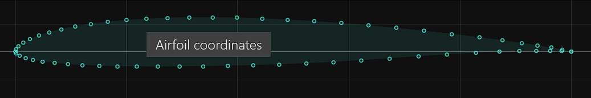
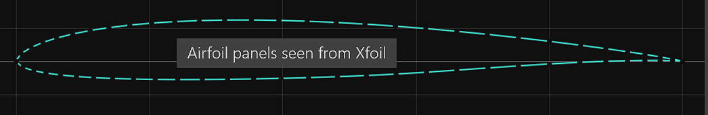
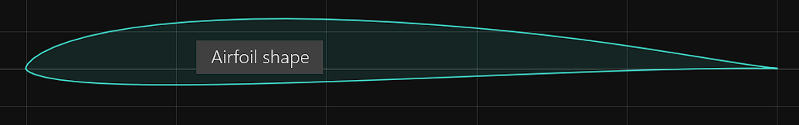
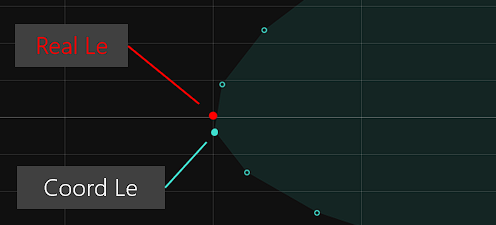
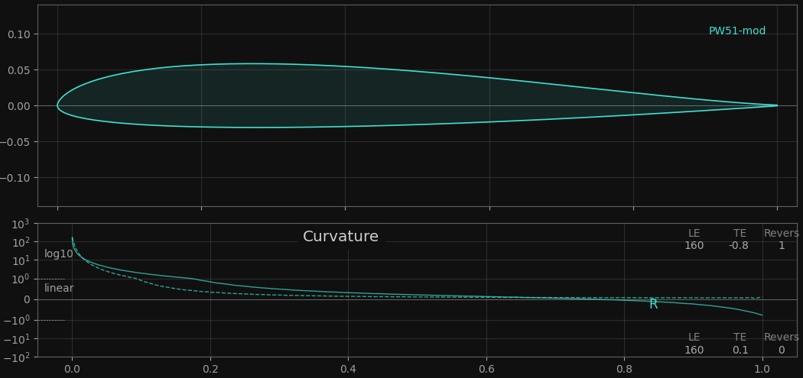
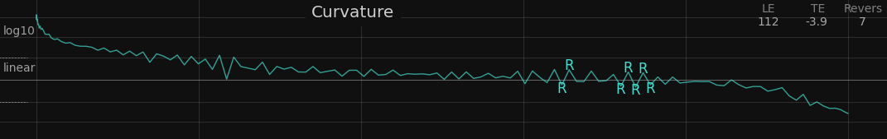
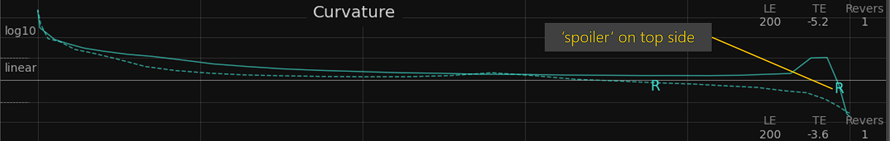
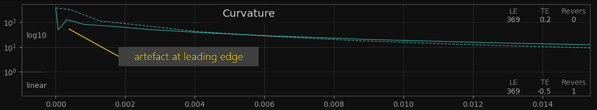

# Geometry of an Airfoil 
{: .no_toc }

This chapter covers the basic geometric properties of an airfoil. Although some aspects may seem familiar, it is essential to understand concepts such as 'paneling' or 'curvature' for successful airfoil optimization.
{: .fs-6 .fw-300 }

Depending on the perspective, the coordinate points of an airfoil can be interpreted differently: as plain coordinates, as a definition of panels, or as data points for a spline describing the shape.


### Table of contents
{: .no_toc .text-delta }

1. TOC
{:toc}

---

## Coordinate Points

An airfoil has n coordinate points in an x,y coordinate system. The x-axis represents the airfoil's chord line.



The coordinate points of a '.dat' file describe the airfoil starting at the top of the trailing edge with point 1, moving forward to the leading edge, and then running down the bottom to the trailing edge with point n. The leading edge is defined by the coordinate point with the smallest x-value. Typically, the leading edge has a value of x=0, y=0. 

The two points at the trailing edge, 1 and n, either coincide at x=1, y=0 or define the trailing edge gap by a y-value other than 0.

### Normalizing the coordinates 

During 'normalization' the coordinate points are shifted, stretched or rotated so that the leading edge is precisely at x=0, y=0 and the trailing edge is at x=1 with a symmetric y-value (trailing edge gap). 
This normalization of the coordinate points is a form of first-degree normalization, as opposed to normalization based on the 'true' leading edge (see below).

## Panels 

The connection line between two coordinate points is referred to as a 'panel'. Collectively, they approximate the contour of an airfoil through small straight sections.



These panels are crucial for the aerodynamic calculation with Xfoil, which is why the calculation is also referred to as a panel method. The length of a panel and the angle difference between two adjacent panels are significant factors for the accuracy and quality of the Xfoil calculation. 

In particular, the angle difference of two adjacent panels should not exceed a maximum value, which is also why the panel length is reduced in areas of high curvature to decrease the angle difference. 
Reducing the panel length, especially at the leading edge, is called 'bunching' and is essential for a more accurate aerodynamic calculation.

### The more the better? 

One may be tempted to increase the number of panels to improve the accuracy of the Xfoil calculation. However, comparing the Xfoil results of an airfoil with 160, 200, or 240 panels, only minor differences will be observed in the main section of the polar. 

Differences mainly occur in the high or negative alpha range where the leading edge plays a crucial role. As a general rule, the higher the panel density at the leading edge, the higher the cl max. The question remains unanswered as to which polar is more realistic, as Xfoil tends to provide too optimistic cl-max values. 

Close to the trailing edge it is also advantageous to reduce the panel length to account for potentially higher pressure gradients on the upper or lower side. The option `te_bunch` specifically affects only the last panels just before the trailing edge, allowing for targeted influence.

The disadvantage of a high panel count is that the Xfoil computation time grows approximately proportional to the number of panels. As the time for an optimization run mainly depends on the Xfoil calculations, the panel count determines the time of an overall optimization run. 

Rules of thumb
- try to use a lower panel count. 160 panels are a good all-around value.
- increase `le_bunch` when the number of panels is reduced. A value of 0.86 for 160 panels is a good starting point.

### Paneling Options

The input file provides several options to control paneling of the seed airfoil before optimization.

```fortran
&paneling_options                               ! options for re-paneling before optimization 
  npan             = 160                         ! no of panels of airfoil
  npoint           = 161                         ! alternative: number of coordinate points
  le_bunch         = 0.86                        ! panel bunch at leading edge  - 0..1 (max) 
  te_bunch         = 0.6                         ! panel bunch at trailing edge - 0..1 (max) 
/
```

The default values are based on many years of experience and do not need to be changed for typical optimization tasks.

## Airfoil as a Shape 



To obtain an airfoil as a curve, a cubic spline is generated that uses the coordinate points as data points. The spline allows to determine any intermediate points with high precision. For example this is used to determine the exact high point of the thickness distribution. 

Xoptfoil2 uses its own spline implementation and does not rely on Xfoil geometry routines.

### Exact normalization of an airfoil 

The spline plays a special role in determining the exact leading edge of an airfoil, which can deviate minimally from the leading edge of the airfoil coordinates (smallest x value). 

The leading edge of the curve spline is defined as the point at which the normal vector runs exactly through the trailing edge. 

{:width="50%"}

When normalizing '2nd order', the airfoil is rotated and stretched so that the leading edge of the curve is exactly x=0 and y=0. The coordinate points are then also shifted so that their foremost point is also at x=0, y=0. 

The '2nd order normalization' of an airfoil is an important basis for comparative airfoil assessments. Therefore, when preparing the initial seed airfoil for an optimization, it is checked whether the airfoil is normalized in this way and, if necessary, such a normalization is carried out.
 
## Curvature of an Airfoil   

The curve curvature or the curvature of the airfoil surface is perhaps the most important geometric property of an airfoil. Mathematically, the curvature is the reciprocal of the curve radius of the circle that is tangential to this point. 

The curvature at the leading edge of the airfoil, which is described by the well-known ‘leading edge radius’, is particularly important. 

The curvature reaches a value between 100 and 500 at the leading edge and then falls continuously towards the trailing edge until it is close to 0, which corresponds to a straight line. 

A positive curvature is described as convex, a negative curvature as concave. 'Normal' airfoils are convex throughout, while special airfoils also have concave parts, such as airfoils with rear-loading, which are concave in the rear part of the bottom side. 
The change from convex to concave is also known as a 'reversal', as the sign of the curvature changes at this point. An important characteristic of an airfoil is therefore whether it has 0 or 1 'reversal' on one side of the airfoil.


Curvature of an airfoil with one 'reversal' on the upper side ('reflexed airfoil'). The curvature becomes negative at approx. x=0.85. Due to high leading-edge curvature values, the curvature is shown on a logarithmic scale.
{: .fs-2}

As the curvature is also a kind of magnifying glass for the airfoil surface, the curvature can also be used to assess the geometric airfoil quality with X-ray vision.  

### Spikes in the curvature 

Quite often the curvature of an existing airfoil is not even and smooth, but rather resembles a low mountain range, as in this example: 



The cause of these spikes is often limited precision in the `.dat` coordinates (for example, only 5 or 6 decimal digits). These small curvature spikes usually do not influence Xfoil results significantly, but they make real curvature reversals harder to detect.

A reversal is detected based on a threshold value (default 0.1). If this value is increased to 0.5, for example, significantly fewer spikes are detected. However, the risk also increases that genuine reversals will no longer be recognized.

{: .tip }
In case of 'spikes', use `check_curvature_bumps` and the `bump_threshold` setting to suppress irrelevant curvature noise before the actual optimization run. This is particularly advisable when using `hicks-henne` shape functions.


### Trailing edge artefacts

Some airfoils show rapidly increasing curvature near the trailing edge. This typically happens in the last 5% to 10% of chord and indicates a small aerodynamic spoiler at the trailing edge. The issue is hard to spot directly because these artefacts are tiny in x,y coordinates.

Xfoil's aerodynamic calculation reacts very sensitively to these mini spoilers on either the upper or lower side, which can lead to artificially improved results.

In fact, a number of well-known airfoils show such a trailing-edge spoiler effect, either accidentally (for example in inverse design workflows) or intentionally.



Because a trailing-edge spoiler can strongly influence aerodynamic results, an optimizer may create one to improve the objective value. Based on the assumption that these artefacts are not structurally meaningful and have limited relevance in real flow, Xoptfoil2 attempts to prevent them.

Detection of such a trailing-edge artefact is based on the curvature value at the trailing edge. The maximum allowed trailing-edge curvature can be set explicitly with `max_te_curvature` or determined automatically with `auto_curvature` from the seed airfoil.

During optimization, `max_te_curvature` acts as a geometric constraint for each new design. When `show_details` is enabled, the number of these violations is printed as `max_te_curv`.

Keep in mind the classic "garbage in, garbage out" effect: if the seed airfoil already contains this artefact, optimization alone usually cannot remove it. In such cases, choose another seed airfoil or adjust curvature settings.


### Leading edge artefacts 

Although trailing edge artefacts are more prominent, attention should be paid to the leading edge in case of high lift optimization where the leading edge (curvature) plays a central role. 

The suction peak and very early transition are extremely sensitive to curvature artefacts, typically within the first 1% of chord length. Tiny curvature changes in this region can significantly influence Xfoil high-lift results near cl max.



In practice, curvature oscillations within the first few coordinate points can act like a small turbulator and artificially improve cl max.

Again, `check_curvature` helps to keep a smooth leading-edge shape by activating an additional internal constraint. The more specific `check_le_curvature` option ensures that leading-edge curvature decreases monotonically.

When `show_details` is enabled, the number of this type of violation is printed as `le_curv_monoton`.


### Seed preparation with Bezier

It is often not easy to identify these curvature artefacts reliably and handle them correctly.
For this reason, optimization starts with a match of the seed airfoil to two Bezier curves, producing a smooth start profile with strongly reduced curvature artefacts. This makes Xoptfoil2 much more robust against the "garbage in, garbage out" effect described above.
The intermediate profile can be inspected in the temporary optimization directory.


## Geometric and Curvature Constraints

Geometric constraints play an important role during optimization. They act as a filter to detect and reject "nonsensical" airfoil designs early, before a time-consuming Xfoil calculation is performed.

Most of the constraints work "under the hood", defined by default values, so that the user only has to make changes in a few cases.

If constraints are set manually, make sure the seed airfoil does not already violate them. Otherwise, optimization is aborted during initialization to ensure a safe and consistent start.

We distinguish between:
- Geometric constraints, which define basic geometric specifications
- Curvature constraints, which define the limit values for high-quality curvature properties of the airfoil   


Common options for **geometric constraints** are: 

| Constraint         | Description                               |
|:-------------------|:------------------------------------------|
|  `check_geometry`  | Enable or disable all geometry constraint checks (default `.true.`). Disabling may improve runtime depending on the optimization task. |
|  `symmetrical`     | If true, only the top surface is optimized and the bottom surface is mirrored. The seed airfoil itself does not need to be symmetrical because mirroring is applied during preparation. |
|  `min_thickness`   | Minimum thickness of the airfoil |
|  `max_thickness`   | Maximum thickness of the airfoil |
|  `min_camber`   | Minimum camber of the airfoil |
|  `max_camber`   | Maximum camber of the airfoil |
|  `min_thickness_at_x`   | Minimum thickness at a given x-position |
|  `min_te_angle`    | Minimum trailing edge angle in degrees – default is 2.0 degrees.  |
|  `min_te_top_angle`   | Minimum trailing-edge angle on the upper side |
|  `max_te_bot_angle`   | Maximum trailing-edge angle on the lower side. Use this to prevent the tail from becoming too thin when stronger rear-loading is introduced on the bottom side. |
|  `min_flap_angle` `max_flap_angle`  | Minimum and maximum flap angle when flap optimization is enabled. Positive values correspond to downward deflection. |


Common options for **curvature constraints** are: 

| Constraint         | Description                               |
|:-------------------|:------------------------------------------|
|  `check_curvature` | Enable or disable all curvature constraint checks (default `.true.`). |
|  `auto_curvature`  | Enable or disable automatic curvature-threshold setup (default `.true.`). When enabled, curvature limits are derived from the seed airfoil so optimized designs preserve similar or better curvature quality. |
|  `check_le_curvature` | Ensure that the leading-edge curvature decreases monotonically |
|  `check_curvature_bumps` | Suppress curvature bumps on the side surfaces |
|  `bump_threshold` | Threshold for detecting curvature bumps |
| `max_curv_reverse_top` | Maximum number of curvature reversals allowed on the top side. One reversal is typical for flying-wing airfoils ('reflexed airfoil'). |
| `max_curv_reverse_bot` | Maximum number of curvature reversals allowed on the bottom side. One reversal is typical for rear-loaded airfoils. |

When option `show_details` is enabled, the counts of different constraint violations are printed for each new design.
