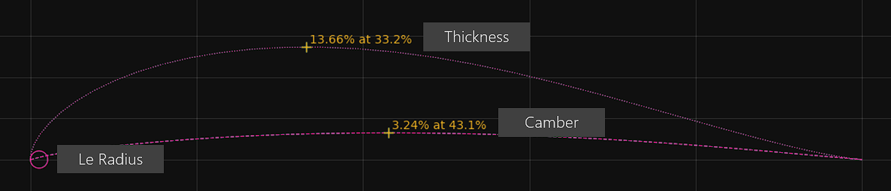
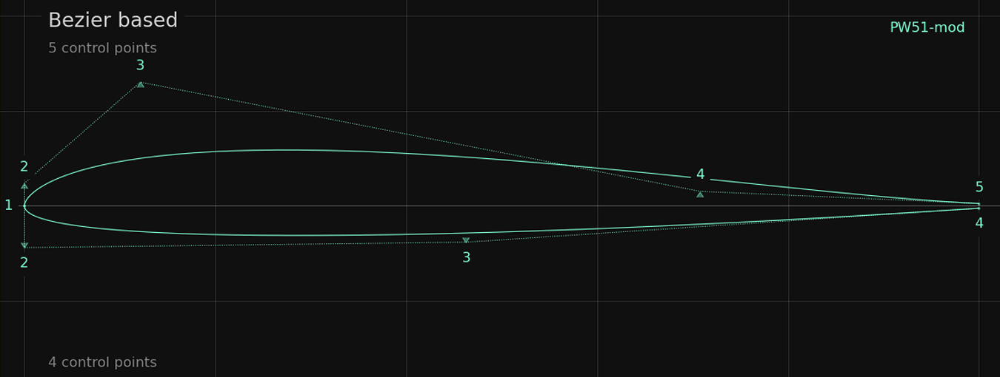
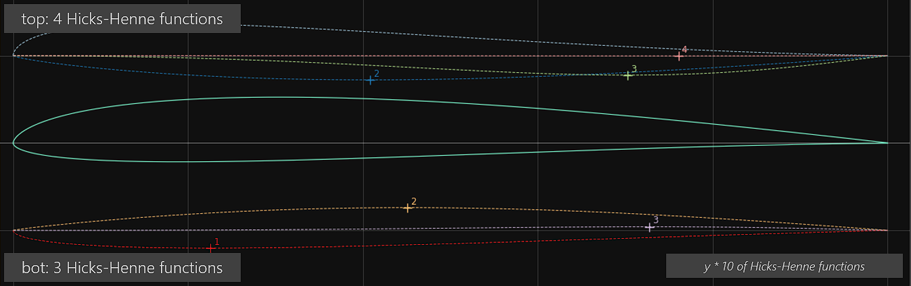

# Shaping the Airfoil 
{: .no_toc }

The creation of new airfoil designs during optimization is made by a 'shape function' which convert the set of design varibales into a new airfoil shape. There are three different 'shape functions' implemented each having its own advantages and disadvantages depending on the optimization task.
{: .fs-6 .fw-300 }

As the shape function is responsible to create the optimal shape for a specific optimization task, a lot of research has been done to find the best shape function that requires the fewest design variables which have to be optimized. In summary, it can be said that there is no 'best shape function' - it depends on the use case. The two implemented shape functions `hicks-Henne` and `bezier` are both very powerful and will show only little difference in the optimized airfoils. Maybe `hicks-Henne` is more the tool for the connoisseur - while `bezier` brings faster results in an uncomplicated manner. 

### Table of contents
{: .no_toc .text-delta }

1. TOC
{:toc}

---
## Camb-Thick shape function 

The shape function `camb-thick` uses an airfoils geometry parameters to modify the airfoil. It is the most convinient methodas no care has to be taken for curvature artefacts or geometry constraints violations.


The shape function 'camb-thick' will modify the typical geometry parameters of an airfoil including leading edge radius and its blending distance.
{: .fs-2}

Per default these 6 parameteres - or design variables - of an airfoils geometry are used respectively modified: 

- Thickness 
- Thickness highpoint position 
- Camber   
- Camber highpoint position
- Leading edge radius 
- Leading edge radius blending distance  

Each of these parameters can de-activated so they won't be changed during optimization. 

The shape function `camb-thick` is ideal for getting a quick estimation of the possible capabilties of an existing airfoil which should be adapted for a certain task - or to adapt an airfoil for a new Reynolds number. See [the Getting started example](#Getting started) for more information. 

As the solution space for new designs is limited it is not advisable to define more than 2,3 or 4 operating points as optimization objectives. In contrast to the shape function `bezier` and `hicks-henne` there is quite seldom a need to define 'helper operating points' to avoid side effects. 

The big advantage of `camb-thick` is the fast convergence of an optimization. Typically after 50 iterations as the design radius is below the `min_radius`, the optimization will be finished. 

### Input Options

Normally no input parameters are needed for shape function `camb-thick` as the defaults activate all possible geometry modifications. In case you want to fix a certain geometry parameter to its current value, the corresponding option can be set to `.false`. 

```fortran
&camb_thick_options                              ! options for shape_function 'camb_thick'
  thickness        = .true.                      ! optimize thickness 
  thickness_pos    = .true.                      ! optimize max. thickness position
  camber           = .true.                      ! optimize camber
  camber_pos       = .true.                      ! optimize max. camber position
  le_radius        = .true.                      ! optimize leading edge radius
  le_radius_blend  = .true.                      ! optimize blending distance for le radius change 
  initial_perturb  = 0.1d0                       ! max. perturb when creating initial designs 
/
```
{: .lh-tight }


## Bezier shape function 

[Bezier curves](https://en.wikipedia.org/wiki/B%C3%A9zier_curve) are an elegant variant of parametric curves. A set of control points define in an intuitive way the shape of the curve.
To shape an airfoil with Bezier curves, two Bezier curves are used: One for the top and one for the bottom side of the airfoil.

The more control points are used for a Bezier curve, the higher is the solution space to shape the surface of the airfoil. Certain control points have a 'fixed role' when a Bezier curve is used as shape function: 

- Point 1: The leading edge point, which is fixed to 0,0 
- Point 2: Defines the tangent and (very much) the curvature at the leading. As the tangent at leading edge has to be vertical, the x-coordinate is fixed to 0 and only the y-coordinate varies.  
- Point n: The trailing edge point fixed at x=1.0. The y-coordinate defines the 'trailing edge gap' 

Typically 4 to 5 control points are enough to cover most of the optimization tasks and wii result in smooth, well formed geometry of the airfoil. 
If the airfoil should have a curve reversal (on the upper side for a reflexed airfoil, on the lower side for an airfoil with rear-loading) on more control point should be taken to cover the curvature requirement. 



Control points of the Bezier curves for upper and lower side. The upper side has one more control point to allow a curve reversal (reflexed airfoil for a flying wing) 
{: .fs-2}

The number of design variables needed for a Bezier curve is calculated by.
```
ndv = (ncp - 3) * 2  + 1        (ncp = no of control points)
```
Therefore, it will need 7 design variables for a single Bezier curve with 6 control points.


### Input Options

Normally no input parameters are needed for shape function `bezier` as the defaults activate all possible geometry modifications. Increase the number of Bezier control points only if you have advanced requirements like 'curvature reversals'. 

```fortran
&bezier_options                                  ! options for shape_function 'bezier'
  ncp_top          = 5                           ! no of bezier control points on top side              
  ncp_bot          = 5                           ! no of bezier control points on bot side
  initial_perturb  = 0.1                         ! max. perturb when creating initial designs
/
```
{: .lh-tight }


### Airfoil preprocessing 

If a normal '.dat' airfoil file is used as the seed airfoil for an optimization, a 'transformation' of a coordinate based geometry to a Bezier based geometry has to be made to achieve an inital 'Bezier design'.

For this, an internal, very fast optimization run is started, which uses a Simplex (Nelder-Mead) optimization to find a Bezier curve which matches as good as possible the original '.dat' airfoil. 

During this 'match-foil' optimization, particular attention is paid to the curvature of the leading and trailing edges in order to obtain a geometrically clean seed airfoil for the subsequent main optimization.

With the option 'show_details' some further information about this 'match-foil' optimization is displayed.  

The final, pre-processed airfoil can always be found in the 'temp' subdirectory of an optimization run. 

### Output airfoil files 

After the optimization has finished there will be an additional airfoil file beside the normal '.dat' file which is a '.bez' file which holds the information about the final Bezier control poin coordinates. 

```
My-Example-Airfoil
Top Start
  0.0000000000  0.0000000000
  0.0000000000  0.0132540570
  0.6491545620  0.0261382462
  1.0000000000  0.0001545000
Top End
Bottom Start
  0.0000000000  0.0000000000
  0.0000000000 -0.0137343844
  0.5252227777 -0.0088367053
  1.0000000000 -0.0001545000
Bottom End
```
{: .lh-tight }


{: .tip }
The [Airfoil Editor](https://github.com/jxjo/PlanformCreator2) is able to read a '.bez' file and visualize the Bezier curves with its control points. It can also be used to modify the Bezier curves.

{: .tip } 
A '.bez' file can also be used as a seed airfoil for Xoptfoil2. As a Bezier based airfoil is per definiton normalized no preprocessing of the seed airfoil will be performed and the optimization will begin on the exact Bezier airfoil definition. This makes '.bez' files ideal for repeated optimization runs.  


### Curvature Aspects

Only Bezier specific aspects of curvature will be discussed below. Please have a look at the common curvature artefacts: 

- [Geometry - trailing edge artefacts](#trailing-edge-artefacts)
- [Geometry - leading edge artefacts](#leading-edge-artefacts)


#### Control poins and curvature 


The less control points are used, the more 'friendly' and uncomplicated Bezier curves are regarding curvature artefacts which make them ideal for optimization. As only a few control points are not able to shape bumps or other artefacts on the surface, the number of 'helper' operatings points can also be reduced which will result in a fast optimization with a good convergence. 

To squeeze out the best performance, it may be needed to enlarge the theorectical solution space with more control points. In this case more and more care has to be taken to avoid curvature artefacts. 

At trailing edge the 2 options `check_curvature`and `auto_curvature` take care for a smooth trailing edge without 'spoilers' or other artefacts. 

#### Leading edge curvature 

A typical problem arises when two independent curves are combined to form an airfoil. For Bezier curves the zeroth and first derivatives are continuous at leading edge as the tangent at leading edge is vertical for both upper and lower side. 

But the second derivate of both curves will differ at leading edge meaning the combind curve won't have C² continuity. When rebuilding such a combined Bezier airfoil out of coordinates and spline, the curvature will show some oscillation artefacts at leading edge. 

The question is what influence these artifacts have on the aerodynamic properties.

To achieve the geometric cleanest possible airfoil, an additional 'geometric constraint' is active when using Bezier curves: The difference of the curvature of the two Bezier curves at leading edge may not exceed the value of the seed airfoil. This constraint adds a quite challenging task to the optimizer. 

When `show_details` is activated, the number of this type of constraint violations is labeled as `max_le_curv_diff`. 


## Hicks-Henne shape function

The shape function `hicks-henne` is an 'additive' airfoil modification approach in which deformations are applied to a seed airfoil. A Hicks-Henne function is a so called 'bump function' describing a bump curve in the range 0..1. 
Having just three parameters - width, strength and location - a Hicks-Henne function can create a impressive variety of bump curves. 

The true strength of the shape function `hicks-henne` arises when several Hicks-Henne functions are combined respectively overlayed:  


Hicks-Henne functions which were a applied to a seed airfoil to create the final airfoil "JX-GT-10". For visibility the y-value of a bump function is multiplied by 10.  
{: .fs-2}

The solution space (variety of shapes) of 3, 4 or 5 Hicks-Henne functions is amazing and will support also sophisticated optimization task. Typically 3, in cases with a desired curvature reversal 4, Hicks-Henne are fine to get good results.

As a single Hicks-Henne function has 3 parameters, the number of design variables needed for one airfoil side is calculated by.
```
ndv = nhh * 3         (nhh = no of Hicks-Henne functions)
```
Example: An optimization task with 4 Hicks-Henne on the top and 3 Hicks-Henne functions on the bot side of the airfoil will result in 21 design variables which is already quite a task for the optimizer. 

{: .note }
As the shape function `hicks-henne` is additive to the seed airfoil, all geometric 'artefacts' of the existing airfoil will be inherited to the airfoil designs: 'garbage in, garbage out'. So the right choice of the seed airfoil is crucial for this shape function.


### Input Options

The default values for the number of Hicks-Henne functions per airfoil side are a good starting point. Always double check with an additional optimization run, if more functions will really improve the result. 

```fortran
&hicks_henne_options                             ! options for shape_function 'hicks-henne'
  nfunctions_top   = 3                           ! hicks-henne functions on top side              
  nfunctions_bot   = 3                           ! hicks-henne functions on bot side
  initial_perturb  = 0.1                         ! max. perturb when creating initial designs 
  smooth_seed      = .false.                     ! smooth (match bezier) of seed airfoil prior to optimization
/
```
{: .lh-tight }


### Airfoil preprocessing 

If a normal '.dat' airfoil file is used as the seed airfoil for an optimization, the airfoil is first checked, if it is 'normlized' (see 'Geometry basic') and a normalization of the airfoil is eventually.

Afterwards the airfoil will be repaneld if it does have already the desired number of panels. 

The final, pre-processed airfoil can be found in the 'temp' subdirectory of an optimization run. 

#### Smoothing the seed airfoil 

In case of a poor geometric quality of the seed airfoil, there is the special option `smooth_seed`:

For smoothing, an internal, fast optimization run is started, which uses a Simplex (Nelder-Mead) optimization to find a Bezier curve which matches as good as possible the original '.dat' airfoil. During this 'match-foil' optimization, particular attention is paid to the curvature of the leading and trailing edges in order to obtain a geometrically clean seed airfoil for the subsequent main optimization.

Afterwards the Bezier curves will be converted back to a have smoothed airfoil which will be a perfect base of Hicks-Henne bump application. 


### Output airfoil files 

After the optimization has finished there will be an additional airfoil file beside the normal '.dat' file which is a '.hicks' file holding the information about the applied Hicks-Henne function in addition to the coordinates of the seed airfoil. 

In a '.hicks' file one line represents the parameter of a single Hicks-Henne-Function: strength, location, width.
The 'width' parameter is not expressed in the airfoil coordinate system. It is a reciprocal value ranging typically von 0.5 to 3.

```
Top Start
  0.0039028924  0.2133662526  1.1956792840
 -0.0003744978  0.3290184511  1.5299985775
 -0.0036362910  0.4569654612  1.0241842170
 -0.0018456634  0.8089582439  1.0062554559
Top End
Bottom Start
 -0.0016882786  0.2202301599  1.0096207740
  0.0021289131  0.4871356384  0.9658124567
  0.0004995242  0.8296992734  1.0455637515
Bottom End
Seedfoil Start
My-Seed-Airfoil
   1.0000000   0.0001545
   0.9930137   0.0010889
   ...         ... 
```
{: .lh-tight }


{: .tip }
The [Airfoil Editor](https://github.com/jxjo/PlanformCreator2) is able to read a '.hicks file and visualize the applied Hicks-Henne functions.

{: .tip } 
A '.hicks' file can also be used as a seed airfoil for Xoptfoil2. In this case no preprocessing will be made and will begin on the exact Hicks-Henne airfoil definition. This makes '.hicks' files ideal for repeated optimization runs.  


### Curvature Aspects

Only Hicks-Henne specific aspects of curvature will be discussed below. Please have a look at the common curvature artefacts: 

- [Geometry - trailing edge artefacts](#trailing-edge-artefacts)
- [Geometry - leading edge artefacts](#leading-edge-artefacts)

#### Bump detection

{: .highlight }
The strength of Hicks-Henne functions in creating a huge variety of bumps is also a danger when it comes to optimization based on only a few operating points. 

If there are only a few operating points, maybe 3-5, there is the danger that each operating point will result in an indivdual real bump where the optimizier tried to maximize the laminar flow length just for this operating point. 

To avoid geometry bumps, use ...
- enough operating points to 'spread' the objectives. For `hicks-henne` a range of 6 - 12 operating points is adviced
- targets as `optimization_type` instead of min/max optimization as the danger of overweighting a single operating point is reduced
- as little as possible, as much as necessary Hicks-Henne functions

Xoptfoil2 has a built-in support to avoid geometric bumps in case of Hicks-Henne: The 'bump detection' being part of the `check_curvature` option during optimization. If there is a geometric bump than derivative of the curvature will have a reversal. So the number of reversals of the derivative is checked during optimization and used as a constraint. 

It sounds a little strange to use Hicks-Henne bump functions and then try to avoid real bumps. But normally a Hicks-Henne function lies gently over the other surface as seen in the screenshot.
