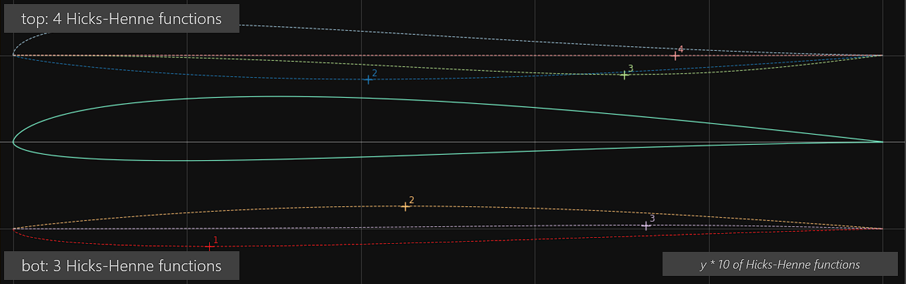

# Shaping the Airfoil
{: .no_toc }

During optimization, new airfoil designs are generated by a shape function, which maps design variables to geometry. Xoptfoil2 currently supports three shape functions, each with its own strengths depending on the optimization task.
{: .fs-6 .fw-300 }

There is no universally "best" shape function. The right choice depends on your use case, required flexibility, and robustness needs.

### Table of contents
{: .no_toc .text-delta }

1. TOC
{:toc}

---
## Camb-Thick shape function 

`camb-thick` was removed. Use `bezier`, `bspline`, or `hicks-henne` instead depending on whether you need a clean geometric fit or localized shape control.


## Bezier shape function 

[Bezier curves](https://en.wikipedia.org/wiki/B%C3%A9zier_curve) are a compact parametric representation where control points define curve shape in an intuitive way.
For airfoils, two Bezier curves are used: one for the upper side and one for the lower side.

Using more control points increases the solution space. Some control points have fixed geometric roles:

- Point 1: Leading edge point, fixed at (0, 0)
- Point 2: Defines leading-edge tangent and strongly influences curvature. Because tangent must be vertical, x is fixed at 0 and only y varies.
- Point n: Trailing edge point, fixed at x=1.0. Its y-value defines trailing-edge gap.

Typically, 5 to 6 control points per side are sufficient for many tasks and usually yield smooth geometry.
If the airfoil should support a curvature reversal (for example reflex on the upper side or rear-loading on the lower side), one additional control point may be helpful.


Control points of the Bezier curves for upper and lower side. The upper side has one more control point to allow a curve reversal (reflexed airfoil for a flying wing) 
{: .fs-2}

The number of design variables for one Bezier side is calculated by:
```text
ndv = (ncp - 3) * 2  + 1        (ncp = no of control points)
```
For example, one Bezier side with 6 control points uses 7 design variables.


### Input Options

In most cases, defaults are sufficient for `bezier`. Increase control-point counts only when you need extra geometric flexibility (for example reliable curvature reversals).

```fortran
&bezier_options                                  ! options for shape_function 'bezier'
  ncp_top          = 6                           ! no of bezier control points on top side
  ncp_bot          = 6                           ! no of bezier control points on bot side
  initial_perturb  = 0.1                         ! max. perturb when creating initial designs
/
```
{: .lh-tight }


### Airfoil preprocessing 

If a normal `.dat` airfoil file is used as the seed airfoil for an optimization, Xoptfoil2 always performs an internal matching step to create an initial Bezier-based design.

This is done with a fast Simplex (Nelder-Mead) optimization that matches the original airfoil as closely as possible while also producing a geometrically clean seed for the subsequent main optimization.

When `show_details` is enabled, additional information about this preprocessing step is printed. The final pre-processed airfoil can be found in the `temp` subdirectory of an optimization run.

This seed-preparation step is not optional; it is part of the standard initialization workflow.

### Output airfoil files 

After optimization, an additional `.bez` file is written beside the normal `.dat` output. It stores final Bezier control-point coordinates.

```
My-Example-Airfoil
Top Start
  0.0000000000  0.0000000000
  0.0000000000  0.0132540570
  0.6491545620  0.0261382462
  1.0000000000  0.0001545000
Top End
Bottom Start
  0.0000000000  0.0000000000
  0.0000000000 -0.0137343844
  0.5252227777 -0.0088367053
  1.0000000000 -0.0001545000
Bottom End
```
{: .lh-tight }


{: .tip }
The [Airfoil Editor](https://github.com/jxjo/PlanformCreator2) is able to read a `.bez` file and visualize the Bezier curves with its control points. It can also be used to modify the Bezier curves.

{: .tip } 
A `.bez` file can also be used as a seed airfoil. Because a Bezier-based airfoil is normalized by definition, no additional preprocessing is required and optimization starts from the exact Bezier definition. This makes `.bez` files ideal for repeated runs.


## B-Spline shape function

The shape function `bspline` is an experimental alternative to Bezier-based shaping. It uses two B-spline curves, one for the upper and one for the lower side of the airfoil, and is intended for cases where a slightly different parameterization is useful.

The current implementation uses degree-4 splines with uniform knots. In the input file, the default number of control points is 7 for both sides.

The matching process works in the same way as for Bezier: a fast internal Simplex optimization is used to fit the spline representation to the seed airfoil.

### Input Options

```fortran
&bspline_options                                 ! options for shape_function 'bspline'
  ncp_top          = 7                           ! no of bspline control points on top side
  ncp_bot          = 7                           ! no of bspline control points on bot side
  initial_perturb  = 0.1                         ! max. perturb when creating initial designs
/
```
{: .lh-tight }

The corresponding Worker command is `-w bspline`.


## Curvature Aspects

Bezier- and B-spline-specific curvature aspects are discussed below. For common artefacts, see:

- [Geometry - trailing edge artefacts](#trailing-edge-artefacts)
- [Geometry - leading edge artefacts](#leading-edge-artefacts)


### Control points and curvature


With fewer control points, curve-based shapes are usually more robust against curvature artefacts, which is helpful for optimization.
Because fewer control points cannot easily form local bumps, you often need fewer helper operating points and convergence can be faster.

To maximize performance, you may increase control-point counts and enlarge the theoretical solution space. In that case, more care is needed to avoid curvature artefacts.

At the trailing edge, `check_curvature` and `auto_curvature` help keep the shape smooth and suppress spoiler-like artefacts.

### Leading-edge curvature

A typical issue appears when two independent curves are combined into one airfoil.
For Bezier curves, the zeroth and first derivatives are continuous at the leading edge because the tangent is vertical on both sides.

However, second derivatives differ at the leading edge, so the combined curve is not C2-continuous there. When this geometry is reconstructed from coordinates/splines, curvature oscillation artefacts can appear near the leading edge.

To address this issue, Xoptfoil2 analytically couples the curvature at the leading edge of both sides. The leading-edge curvature is calculated from the y-coordinate of the second control point and the x-coordinate of the third control point.

During both Bezier matching and the main optimization, the lower side's leading-edge curvature is set to match the upper side's value. This coupling reduces the number of design variables on the lower side by one while ensuring both sides have identical leading-edge curvature.

Another critical aspect: leading-edge curvature typically reaches its maximum value at the leading edge itself. However, a few airfoils show maximum curvature slightly back from the very leading edge (about 1–2 coordinate points).

The `check_le_curvature` option (default `.true.`) enforces that both sides achieve their curvature maximum at the leading edge, ensuring curvature decreases monotonically moving back from it.
When `show_details` is enabled, the corresponding violation counter is reported as `le_curv_monoton`.


## Hicks-Henne shape function

The shape function `hicks-henne` is an additive airfoil-modification approach where local deformations are applied to a seed airfoil. A Hicks-Henne function is a bump function defined over the range 0..1.
With just three parameters (width, strength, location), it can generate an impressive variety of bump shapes.

The true strength of `hicks-henne` appears when several functions are combined (overlaid):


Hicks-Henne functions applied to a seed airfoil to create final airfoil "JX-GT-10". For visibility, the y-value of each bump function is multiplied by 10.
{: .fs-2}

The solution space from 3, 4, or 5 Hicks-Henne functions is large and supports sophisticated tasks. Typically, 3 functions per side are sufficient; for strong curvature-reversal demands, 4 may be useful.

As each Hicks-Henne function has 3 parameters, the number of design variables for one side is:
```text
ndv = nhh * 3         (nhh = no of Hicks-Henne functions)
```
Example: 4 functions on top and 3 on bottom produce 21 design variables, which is already a demanding optimization task.

{: .note }
Because `hicks-henne` is additive to the seed airfoil, geometric artefacts in the seed are inherited by new designs ("garbage in, garbage out"). Choosing a clean seed airfoil is therefore crucial.


### Input Options

Default values for Hicks-Henne function counts are a good starting point. Always verify with an additional run whether more functions actually improve results.

```fortran
&hicks_henne_options                             ! options for shape_function 'hicks-henne'
  nfunctions_top   = 3                           ! hicks-henne functions on top side              
  nfunctions_bot   = 3                           ! hicks-henne functions on bot side
  initial_perturb  = 0.1                         ! max. perturb when creating initial designs 
/
```
{: .lh-tight }


### Airfoil preprocessing 

If a normal `.dat` file is used as seed airfoil, it is first checked and normalized if needed (see the Geometry chapter).

Afterward, the airfoil is repaneled to the configured panel count.

The final preprocessed airfoil can be found in the `temp` subdirectory of an optimization run.

#### Seed preparation

For a `.dat` seed airfoil, Xoptfoil2 now always performs an internal Bezier matching step before the main optimization begins. This produces a clean starting geometry for Hicks-Henne optimization.

The matching step is a fast Simplex (Nelder-Mead) optimization that fits Bezier curves to the original airfoil while paying special attention to leading and trailing edges.


### Output airfoil files 

After optimization, an additional `.hicks` file is written beside the normal `.dat` output. It stores applied Hicks-Henne functions together with seed-airfoil coordinates.

In a `.hicks` file, one line represents one Hicks-Henne function: strength, location, width.
The width parameter is not expressed directly in airfoil coordinates. It is a reciprocal value, typically in the range 0.5 to 3.

```
Top Start
  0.0039028924  0.2133662526  1.1956792840
 -0.0003744978  0.3290184511  1.5299985775
 -0.0036362910  0.4569654612  1.0241842170
 -0.0018456634  0.8089582439  1.0062554559
Top End
Bottom Start
 -0.0016882786  0.2202301599  1.0096207740
  0.0021289131  0.4871356384  0.9658124567
  0.0004995242  0.8296992734  1.0455637515
Bottom End
Seedfoil Start
My-Seed-Airfoil
   1.0000000   0.0001545
   0.9930137   0.0010889
   ...         ... 
```
{: .lh-tight }


{: .tip }
The [Airfoil Editor](https://github.com/jxjo/PlanformCreator2) can read a `.hicks` file and visualize applied Hicks-Henne functions.

{: .tip } 
A `.hicks` file can also be used as seed airfoil. In this case no preprocessing is needed and optimization starts from the exact Hicks-Henne definition. This makes `.hicks` files ideal for repeated runs.


### Curvature Aspects

Only Hicks-Henne-specific curvature aspects are discussed below. For common artefacts, see:

- [Geometry - trailing edge artefacts](#trailing-edge-artefacts)
- [Geometry - leading edge artefacts](#leading-edge-artefacts)

#### Bump detection

{: .highlight }
The ability of Hicks-Henne functions to create many local shapes is powerful, but can be risky when optimization uses only a few operating points.

With only a few operating points (for example 3 to 5), the optimizer may create individual local bumps tailored to each point, often to maximize laminar flow only locally.

To avoid geometric bumps, use:
- enough operating points to spread objectives. For `hicks-henne`, a range of 6 to 12 points is often practical.
- `target-*` objectives instead of pure min/max objectives to reduce overweighting of single points.
- as few Hicks-Henne functions as necessary.

Xoptfoil2 has built-in support to avoid geometric bumps for Hicks-Henne, via bump detection as part of curvature checking. If a real geometric bump appears, curvature derivative tends to reverse sign. The number of such reversals is checked during optimization and used as a constraint.

It may sound contradictory to use bump functions and then suppress bumps. In practice, well-tuned Hicks-Henne functions produce smooth global shape adjustments, while bump detection filters out non-physical local artefacts.
