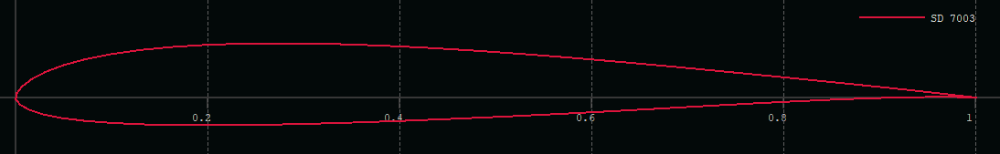
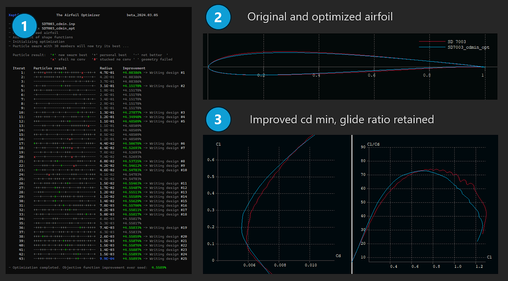

# Getting started 

In this little tour we want to run our first airfoil optimization. It is not about understanding everything what is happening 'behind the curtain' but much more to get a first impression what Xoptfoil2 can achieve - and to experience, that airfoil optimization can be quite easy, if we (the user) don't make it too complicated. Let's go ...
{: .fs-6 .fw-300 }

## The optimization task 

We want to use the fine SD7003 airfoil for our new project. Being one of the first 'bubble ramp' airfoils the SD7003 was one of the conerstones in airfoil development. It is working perfectly a low Reynolds numbers. Because of that it is often used as a tip airfoil in a wing airfoil 'strak'.

In our new project the SD7003 shall be used as the base airfoil for the complete wing. To get best performance the SD7003 should be modified to handle the higher Reynolds number when used in the root wing section. Our new glider should become a quite fast allrounder with a good overall performance.

Therefore we define the optimization task as follows: 
1. optimize for Re=400000 at the root section
2. minimize drag at cl=0.2
3. retain the glide ratio of the original SD7003 at cl=0.7
4. the final airfoil should have 8% thickness

One way to go from here would be to fiddle around in Xflr5 trying to adapt geometry parameters like thickness highpoint (generations of users did this in endless sessions) ...
Or we use Xoptfoil2 to do the job.

## Get and run Xoptfoil2

In the Xoptfoil2 GitHub repo we find the actual version in the [Releases section](https://github.com/jxjo/Xoptfoil2/releases). In 'Assets' there some zip files: 
- a ready build version for Windows 
- the source files for building Xoptfoil2 under Linux

Windows{: .label .label-blue } 
Just download the Windows zip-file and extract it in any subdirectory - maybe for the first tries directly on the Windows Desktop. Xoptfoil2 is a very lightweight installation, which doesn't 'install' any other artefacts on your PC. Go to the folder `.\examples\SD7003_camb_thick` and double click on `make.bat`.

Linux{: .label .label-red } 
Please have a look in the [installation guide] for making your own build of Xoptfoil2. 
After a successful build open a shell in `.\examples\SD7003_camb_thick` and enter 
`Xoptfoil2 -i SD7003_cdmin.inp -o SD7003_cdmin_opt`

The optimization is starting. We see a growing list on the screen showing each iteration step of the optimization. In each line there is a long string with `+`, `-`, `x` showing success or failure of each particle of particle swarm team.  A green **`+`** tells "I'm the best!" which results in an overall improvement. 

## Looking at the results

After a minute or so our first optimization run finished. The result should look like (1) in the following screenshot:

In Xflr5 we load both airfoils, the original SD7003.dat and the optimized SD7003_cdmin_opt.dat and take a look on the geometry of both airfoils (2): 
- thickness is now 8% - that's what we wanted
- position of thickness highpoint didn't change 
- but position of camber highpoint moved from 33% to 45% reflecting the higher Reynolds number 

We switch to 'Direct Analysis' and gernerate a T1 polar for Re=400000 and ncrit=9. Thepolars should look like (3) in the screenshot. 

- cl-cd polar: our new airfoil has a reduced drag at cl=0.2 of about 7% - not too bad. 
- cl/cd - cl polar: glide ratio at cl=0.7 retained the same - well done

In the meantime we changed our mind. Gliding around is something for old men (!). We want the fastest machine on the field ...

## Fly faster!

Maybe the good old SD7003 has also some racing genes? 
Let's try it! 

With a normal text editor we open the Xoptfoil2 input file `SD7003_cdmin_opt.inp` and apply two changes: 

1. We tell the optimizer that the glide ratio at cl=0.7 may become 5% worse (because we want speed!). For this `target_value(2) = -1.0` has to be changed to `target_value(2) = -0.95` 
2. We reduce the thickness to 7.5% by changing `target_geo(1)   = 0.08` to `target_geo(1)   = 0.075`

That's it. We'll can start the optimizer again and see what happens ...

## Where to go from here? 

Although the example optimization of the SD7003 looks quite simple, there is a lot to learn and experience about airfoil geomery and airfoil aerodynamic properties, about optimization when adding an extra operating point, ... so take some time to get a good understanding

{: .tip }
Activate `show_details` in the input file to get extra information what is happening during optimization 

If you want to have a deeper dive into Xoptfoil2, I recommend to go through the sections Optimization, Particle Swarm, Shaping and Optimization Objectives to explore the possibilities of the program... 

