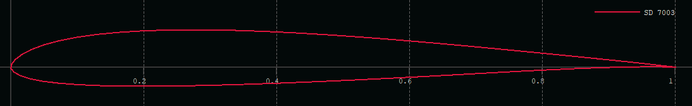
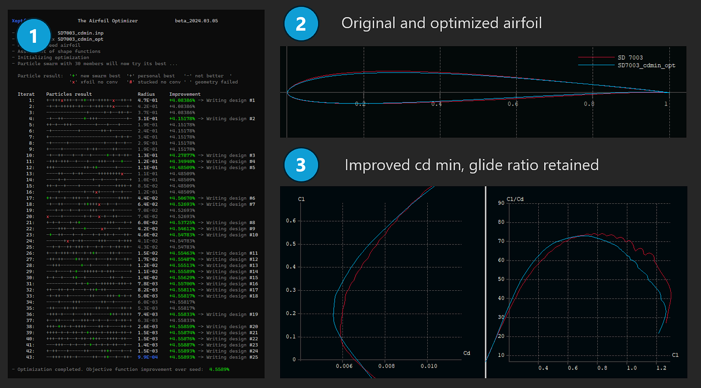

# Getting started 

Welcome. This guided tour walks you through a first airfoil optimization run. You do not need to understand every detail yet—the goal is to get a practical first impression of the workflow.
{: .fs-6 .fw-300 }

## The optimization task 

We use the well-known SD7003 airfoil as the starting point. The SD7003 is a classic low-speed design often used at small scales. It is frequently used as a wing-tip airfoil in airfoil families where different sections are optimized for different positions along the wing (a practice called 'straking').



In our example project, we'll adapt the SD7003 for use across the entire wing. The root section (where the wing meets the fuselage) operates at higher Reynolds numbers than the tip, so we need to modify the shape slightly to maintain good performance there. Our goal is a well-rounded design that's both fast and efficient.

Here's what we want to achieve:
1. Optimize the airfoil for a Reynolds number of 400,000 (typical for a wing root)
2. Minimize drag when flying at a lift coefficient of 0.2
3. Keep the same glide ratio as the original SD7003 at a lift coefficient of 0.7
4. Maintain a thickness of 8%

Traditionally, this process is done by manually adjusting geometry parameters in a tool like XFLR5 and testing each variation. Here, Xoptfoil2 performs that search automatically.

## Get and run Xoptfoil2

Download Xoptfoil2 from the [Releases section](https://github.com/jxjo/Xoptfoil2/releases) on GitHub. In the 'Assets' you'll find:
- A ready-to-run Windows version
- Source files for building on Linux

<span>Windows</span>{: .label .label-blue }
Download the Windows zip file and extract it anywhere—your Desktop is fine for testing. Xoptfoil2 is lightweight and doesn't clutter your system with dependencies. Navigate to `.\examples\SD7003_fast` and double-click `make.bat` to start.


<span>Linux</span>{: .label .label-red }
See the [installation guide](#installation) for building Xoptfoil2 from source. Once built, open a terminal in `./examples/SD7003_fast` and run:
```
xoptfoil2 -i SD7003_fast.xo2
```

The optimization then starts. You will see a scrolling list for each iteration. Each line contains `+`, `-`, and `x` symbols for the different particles (candidate designs) in the search. A green **`+`** marks the best design found so far.


## Looking at the results

After a minute or so, your optimization completes. The results should match (1) in the screenshot below:



Open both airfoils in [Airfoil Editor](https://github.com/jxjo/AirfoilEditor) or XFLR5 — the original SD7003.dat and the optimized SD7003_fast.dat—and compare their geometry (2):
- **Thickness**: Now 8%, exactly as requested ✓
- **Location of maximum thickness**: Unchanged (the optimizer kept what worked)
- **Location of maximum camber**: Shifted from 33% to 45% chord to handle the higher Reynolds number

Generate a T1 polar in [Airfoil Editor](https://github.com/jxjo/AirfoilEditor) or XFLR5 for Re=400,000 with ncrit=9. The results (3) show:
- **Drag reduction**: At cl=0.2, drag decreased by about 7%.
- **Glide ratio**: At cl=0.7, the glide ratio stayed at the requested level.

Now assume your project priorities have shifted: speed is more important than pure efficiency. The next run shows how to adapt the setup.

## Fly faster!

Next, we tune the same airfoil for more speed.

Open the input file `SD7003_fast.xo2` in any text editor and make two small changes:

1. **Relax the glide-ratio goal**: Reduce the glide ratio target value of the second operating point: Change
`target_value(2) = 74` to `target_value(2) = 70`.
2. **Reduce thickness**: Change `target_geo(1) = 0.080` to `target_geo(1) = 0.075`. A thinner airfoil typically has less drag at lower cl.

Save the file and run the optimizer again to evaluate the updated priorities.

## Where to go from here? 

Even though this example seems straightforward, airfoil geometry and aerodynamic behavior are rich topics. As you explore further—adding more operating points, experimenting with constraints, trying different shape functions—you'll deepen your understanding of what's possible.

{: .tip }
Tip: Enable `show_details` in the input file to display additional information for each optimization step.

For a deeper introduction, continue with the [Airfoil Optimization]() chapter. It covers shape functions, operating points, and advanced options.


