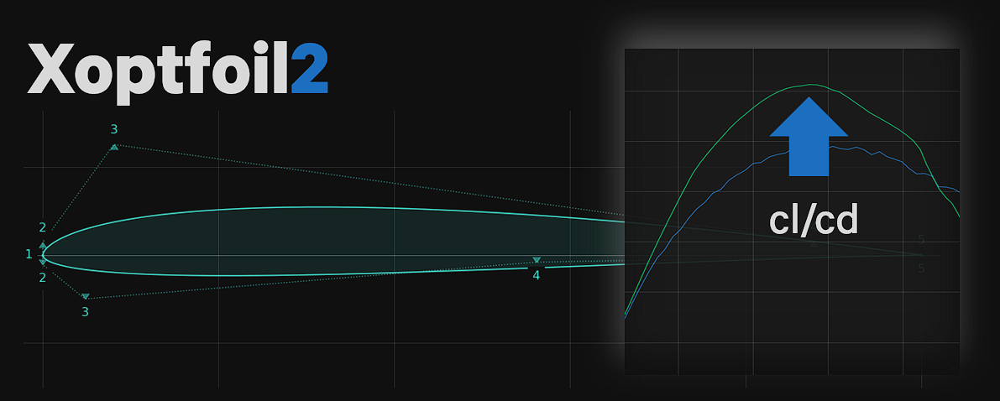

# The Airfoil Optimizer 
{: .fs-9 }

Optimize an airfoil based on its aerodynamic characteristics. 
{: .fs-6 .fw-300 }

Xoptfoil2 follows an approach to airfoil design that could be called 'design by polars' - in contrast to the classic design methods such as 'inverse design' or 'direct design'. 

A new, optimized airfoil is described by its aerodynamic properties with objectives at some operating points. The optimizer will try to design an airfoil geometry which satisfies these objectives best possible.  

Xoptfoil2 was already used to develop some high end [airfoil families](https://github.com/jxjo/Airfoils) for F3B/F3F model gliders. 

[Get started](#Getting started){: .btn .btn-primary .btn-green } ... run your first example optimizations. 
{: .mt-6}

---

## Main features

* Optimization using 'Particle Swarm Optimization'
  - particle retry and rescue 
  - dynamic weighting of operating points 
* Aerodynamic evaluation based on Xfoil
  - retry of unconverged operating points 
  - outlier detection of xfoil results  
* Available shape functions 
  - Hicks Henne bump functions
  - Bezier curves  
  - Geometry parameter modification 
* Definition of an optimization task with operating points by
  - min cd, max cl/cd, max cl, min sink 
  - target values for cd, cl/cd, cm 
  - flap angle or flap angle optimization  
* Geometry targets thickness and camber 
* Curvature control 
  - bump detection for Hicks Henne shape type 
  - max curvature at trailing edge 
* Rerun optimization with refined targets 
* 'Worker' tool for automization of typical tasks 

---

[Download](https://github.com/jxjo/Xoptfoil2/releases){: .btn .btn-purple} ... the latest release from Github.
{: .mt-6 }

---

## About the project

Xoptfoil2 is the successor of the awesome Xoptfoil by Daniel Prosser and [Xoptfoil-JX](https://github.com/jxjo/Xoptfoil-JX/tree/master), a branch of the original Xoptfoil. The objectives of the project are:
- building a robust and reliable airfoil optimization kernel supporting future extensions in various aspects. 
- an airfoil optimizer GUI, which allows to define, visualize and analyze an optimization task - WiP

Jochen Guenzel, 2024 