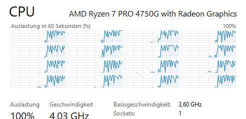

## CPU load during optimization
{: .no_toc }

Xoptfoil2 makes intensive use of multi threading during particle swarm optimization. Here each particle gets its own (next free) thread to perform the CPU-intensive aerodynamic viscous with xfoil. 

A special parameter in the input file allows to control how many CPU threads Xoptfoil2 should use during optimization: 

```fortran
&optimization_options                            
  cpu_threads      = nThreads                         
/  
```

If `nThreads` is positive, then this number of threads will be used. If `nThreads` is negative, then the maximum avaiable number of threads will bei reduced by `nThreads`.

In this example an optimization was just started using all available threads.



The default setting is `cpu_threads = -1` leaving one thread free to allow more or less normal working with the PC.  