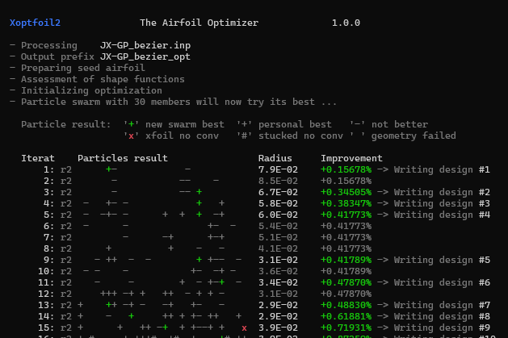

### Run Xoptfoil2

The optimizer is started as a shell command with command line arguments. The optimization task is defined with an input file which provides Xoptfoil2 with all information needed. 

A minimum start command would look like this: 

```
   xoptfoil2  myCase.xo2
```

After initial checks and seed-airfoil preparation, the particle swarm optimization starts. Each iteration line shows the outcome of all particles in the swarm.

{:width="80%"}

Use the option `show_details` to get more information about checks, validations and the status of each operating point during optimization.

### Stop

Once an optimization is started there is only limited possibility stop an optimization.

The easiest way is just to close the command / shell window. The execution of Xoptfoil2 will be 
stopped immediately without creating a final airfoil. This is fine for all cases in which you recognise at an early stage that the optimisation is going in the wrong direction. 

When the optimizer is converging slowly with little improvement, a clean stop is possible. When Xoptfoil2 is up and running a little file named `run_control` is created in the current directory. Open this file with a text editor, write 'stop' in the first line and save the file. Another option is to write the shell command (or put this in a little script)

```
   echo stop > run_control 
```
Xoptfoil2 will then perform a 'friendly' shut-down and write the current optimized airfoil to file.


### Rerun an Optimization

If a first optimization run already produced a good result and only minor improvements at specific operating points are needed, it is faster to rerun from the previous result with adjusted targets than to restart from scratch.

To make a 'rerun' the output airfoil of the last optimization is taken as the seed airfoil for the next optimization. When using either the previously generated 
- Bezier airfoil file `.bez` or the
- Hicks Henne airfoil file `.hicks`

as the seed airfoil, the optimization will 'continue' without a loss of information or accuracy. In this case the shape function parameters will be taken from the seed airfoil - any changed shape settings in the input file will be ignored. 


