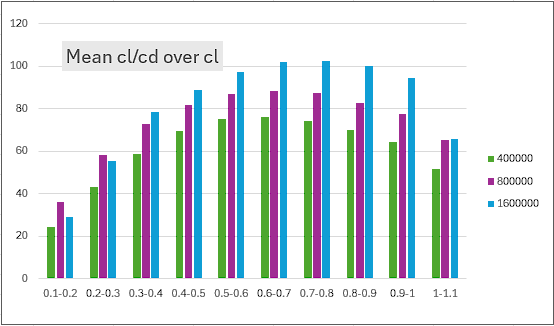
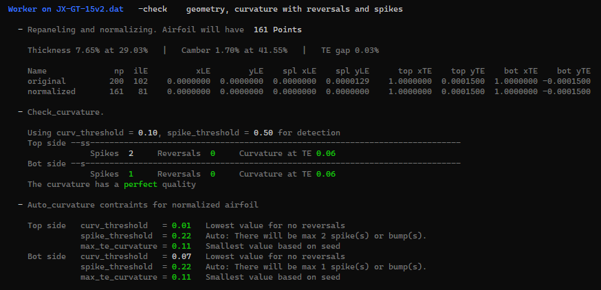

# Worker Tool
{: .no_toc }

The 'worker' is a handy command line tool to perform various tasks related to airfoil modification and optimization.
{: .fs-6 .fw-300 }

Typically it is called within a batch job to automate repeating tasks like setting flap positions and calculating polars for these flapped airfoils. The tool uses the internal functions of Xoptfoil2 so the results are exactly the same as the results of the operations during optimization. 

The basic format of a 'worker' call is like: 

```
   worker -w <worker_action> -a airfoil_file [options]
```

The additional `[options]` depend on the respective worker action described in the following sections. 

### Table of contents
{: .no_toc .text-delta }

1. TOC
{:toc}


---

## Repanel and normalize (-w norm)

The airfoil will be [repaneled and normalized](#normalizing-the-coordinates) to have the leading edge at 0,0 and the trailing edge at 1,0.  The new airfoil will have 7 decimals in the .dat file.

The default number of data points of the new airfoil is 161. This value can be changed if via the input file with the parameter npan in namelist `&paneling_options`. 

   
| Argument                         | Usage     | Description                               |
|:---------------------------------|:----------|:------------------------------------------|
| <nobr>-w norm</nobr>             | mandatory | worker command   |
| <nobr>-a airfoil_file</nobr>     | mandatory | airfoil file  |
| <nobr>-i input_file</nobr>       | optional  | name of input file which holds the paneling options  |
| <nobr>-o output_prefix</nobr>    | optional  | Name of the normed airfoil `<output_prefix>.dat`.  If option -o is omitted, the name of the output file will be `<airfoil_name>_norm.dat`

The input file allows to define further paneling options:  

```fortran
&paneling_options                                ! options for re-paneling before optimization 
  npan             = 160                         ! no of panels of airfoil
  npoint           = 161                         ! alternative: number of coordinate points
  le_bunch         = 0.86                        ! panel bunch at leading edge  - 0..1 (max) 
  te_bunch         = 0.6                         ! panel bunch at trailing edge - 0..1 (max) 
/
``` 
{: .lh-tight }


#### Example <span>Windows</span>{: .label .label-blue }

 This little batch job will normalize all airfoils, their name beginning with 'MH' in the current subdirectory 

```
     dir MH*.dat /B > temp.txt
     for /f "delims=#" %%f in (temp.txt) do (
        worker -w norm -a "%%f"
     )
     del temp.txt
```
{: .lh-tight }


---

## Set flap (-w flap)

The flap is set to a defined angle after the airfoil was repaneled and normalized.
If more than one flap angle is defined several airfoils will be generated having the flap angle as part of the airfoil name.

   
| Argument                         | Usage     | Description                               |
|:---------------------------------|:----------|:------------------------------------------|
| <nobr>-w flap</nobr>             | mandatory | worker command   |
| <nobr>-a airfoil_file</nobr>     | mandatory | airfoil file  |
| <nobr>-i input_file</nobr>       | mandatory | name of input file which holds the flap parameters  |
| <nobr>-o output_prefix</nobr>    | optional  | Name of the flapped airfoil `<output_prefix>_f<angle>.dat`. If option -o is omitted, the name of the output file will be `<airfoil_name>__f<angle>.dat`


The flap parameters are defined via the input file: 

```fortran
&operating_conditions                            ! options to describe the optimization task
  x_flap                 = 0.75                  ! chord position of flap 
  y_flap                 = 0.0                   ! vertical hinge position 
  y_flap_spec            = 'y/c'                 ! ... in chord unit or 'y/t' relative to height
  flap_angle             = 0.0                   ! list of flap angles to be applied
``` 
{: .lh-tight }


#### Example

The following worker command will generate 5 airfoils having the defined flap angles.

```
worker -w flap -i flap.inp -a RG15.dat 
```

with the input file 'flap.inp':

```fortran
&operating_conditions                             
  x_flap             = 0.75                     ! chord position of flap 
  flap_angle         = 2, 4, 6, 8, 10           ! list of flap angles to be set
/
```
{: .lh-tight }


---

## Set geometry (-w set)

The 'set' command allows the modification of an airfoils geometry parameter:
- thickness and location of maximum thickness, 
- camber and location of maximum camber,
- trailing edge thickness 

   
| Argument                         | Usage     | Description                               |
|:---------------------------------|:----------|:------------------------------------------|
| <nobr>-w set \<parameter\> </nobr>  | mandatory | worker command - \<parameter\> defines the modification which should be applied to the airfoil:   |
| <nobr>-a airfoil_file</nobr>     | mandatory | airfoil file  |
| <nobr>-i input_file</nobr>       | optional | name of input file which holds the optional paneling parameters  |
| <nobr>-o output_prefix</nobr>    | optional  | name of the created airfoil `<output_prefix>_<parameter>.dat`. If option -o is omitted, the name of the output file will be `<airfoil_name>_<parameter>.dat`

The \<parameter\> may have these values:

| \<parameter\>               |  Description                              |
|:----------------------------|:------------------------------------------|
| <nobr>t=yy</nobr>           | Set thickness to xx% |
| <nobr>xt=xx</nobr>          | Set location of maximum thickness to xx% of chord |
| <nobr>c=yy</nobr>           | Set camber to xx% |
| <nobr>xc=xx</nobr>          | Set location of maximum camber to xx% of chord |
| <nobr>te=yy</nobr>          |Set trailing edge gap to xx% of chord |


#### Example


```
worker -w set t=8.5 -a RG15.dat 
```

... will set the thickness of airfoil RG15 to 8.5%. The new file will be `RG15_t8.5.dat`. 


---

## Match Bezier (-w bezier)

Two Bezier curves - one for the upper, one for the lower side - are matched to the airfoil to create a new, smoothed airfoil.

For this, an internal, very fast optimization run is started, which uses a Simplex (Nelder-Mead) optimization to find a Bezier curve which matches as good as possible the original '.dat' airfoil. 

During this 'match-foil' optimization, particular attention is paid to the curvature of the leading and trailing edges in order to obtain a geometrically clean seed airfoil for the subsequent main optimization.

As a result, 2 airfoils are generated:
- a normal '.dat' file of the Bezier matched airfoil 
- a '.bez' file containing the controll points of the Bezier curves. 

Both file types can be visualized with the app [Airfoil Editor](https://github.com/jxjo/AirfoilEditor) as show below


 See chapter [Bezier shape function](#bezier_shape_function) for more information on Bezier based airfoils. 

   
| Argument                         | Usage     | Description                               |
|:---------------------------------|:----------|:------------------------------------------|
| <nobr>-w bezier </nobr>          | mandatory | worker command  |
| <nobr>-a airfoil_file</nobr>     | mandatory | airfoil file to match with Bezier curves |
| <nobr>-i input_file</nobr>       | optional  | parameters of the Bezier curves for upper and lower side  |
| <nobr>-o output_prefix</nobr>    | optional  | name of the created airfoil `<output_prefix>.dat`. If option -o is omitted, the name of the output file will be `<airfoil_name>-bezier.dat`

The Bezier parameters are defined via the input file: 

```fortran
&bezier_options                                  ! options for shape_function 'bezier'
  ncp_top          = 5                           ! no of bezier control points on top side              
  ncp_bot          = 5                           ! no of bezier control points on bot side
/

&paneling_options                                ! options for re-paneling before optimization 
  npan             = 160                         ! no of panels of airfoil
  npoint           = 161                         ! alternative: number of coordinate points
  le_bunch         = 0.86                        ! panel bunch at leading edge  - 0..1 (max) 
  te_bunch         = 0.6                         ! panel bunch at trailing edge - 0..1 (max) 
/
``` 
{: .lh-tight }


#### Example <span>Windows</span>{: .label .label-blue }

This little batch job will create a Bezier based 'match-foil' of each airfoil in the current directory. 
The default value of 5 Bezier control points for upper and lower side will be used. 

```
@echo off
dir *.dat /B /O > temp.txt
for /f "delims=#" %%f in (temp.txt) do (
  worker -w bezier  -a "%%f" 
)
del temp.txt
```
{: .lh-tight }


---

## Generate polars  (-w polar)

Polars of an airfoil will be generated in Xfoils polar format. The generated polar file is ready to be imported into xflr5 or flow5 via the menu function `Polars / Import Xfoil Polar(s)`.

Worth mentioning is the possibility to combine polar generation and flap setting in a single step. The input file allows to define a sequence of flap angles for which the defined polars will be generated automatically. The 'flapped' airfoils will be additionally written at the end of polar gneration.

The polars will be generated in the subdirectory `<airfoil_file>_polars` of the current directory.
   
| Argument                         | Usage     | Description                               |
|:---------------------------------|:----------|:------------------------------------------|
| <nobr>-w polar</nobr>            | mandatory | worker command   |
| <nobr>-a airfoil_file</nobr>     | mandatory | airfoil file  |
| <nobr>-i input_file</nobr>       | mandatory | name of input file which holds the parameters for polar generation  |
| <nobr>-o output_prefix</nobr>    | optional  | Alternative file name `<output_prefix>.csv` |


The polar itself is defined via the input file: 

```fortran
&polar_generation                                ! options only for 'Worker'   
  polar_reynolds   = 0                           ! list of reynolds like 100000, 200000, 600000
  polar_mach       = 0                           ! list of mach like 0.1, 0.2, 0.5
  type_of_polar    = 1                           ! either Type 1 or Type 2 polar 
  auto_range       = .false.                     ! best values for mode and range automatically set
  op_mode          = 'spec-al'                   ! range based on alpha or cl 
  op_point_range   = -2, 10, 0.25                ! range start, end, delta 
/

&xfoil_run_options
  ncrit            = 7                           ! ncrit default value for op points 
  xtript           = 1.0                         ! forced transition point 0..1 - top  
  xtripb           = 1.0                         ! forced transition point 0..1 - bot  
  vaccel           = 0.005                       ! xfoil vaccel parameter
/

&operating_conditions                            ! options to describe the optimization task
  x_flap                 = 0.75                  ! chord position of flap 
  y_flap                 = 0.0                   ! vertical hinge position 
  y_flap_spec            = 'y/c'                 ! ... in chord unit or 'y/t' relative to height
  flap_angle             = 0.0                   ! list of flap angles to be set
``` 
{: .lh-tight }

#### Example

The following worker command will generate a set of T1 polars for the RG15 airfoil.
The alpha range is automatically determined to include 'cl max' (positve alpha) and 'cl min' (negative alpha). 

Polar generation will be done for 4 flap angles. So all together 5 * 4 polars will be generated using multi threading with one worker command.

Laminar-turbulent transition is controlled by ncrit=7.

```
worker -w polar -i polars.inp  -a RG15.dat 
```

with the input file 'polars.inp':

```fortran
&polar_generation
  polar_reynolds     = 20000, 50000, 100000, 200000, 500000
  type_of_polar      = 1                        ! T1 polar 
  auto_range         = .true.                   ! auto values for mode and range
/
&operating_conditions                             
  x_flap             = 0.75                     ! chord position of flap 
  flap_angle         = -1.0, 0.0, 2.0, 4.0      ! list of flap angles to be set
/
&xfoil_run_options
  ncrit              = 7                        ! xfoils ncrit value                          
/
```
{: .lh-tight }


---

## Generate polars as CSV file (-w polar-csv)

Polars of an airfoil will be generated in CSV format. The generated polar file is ready to be imported into Excel or other programs supporting CSV import.

Worth mentioning is the possibility to combine polar generation and flap setting in a single step. The input file allows to define a sequence of flap angles for which the defined polars will be generated automatically. The 'flapped' airfoils will be additionally written at the end of polar gneration.

In contrast to `-w polar` the polar data is written and appended to a single file `<airfoil_name>.csv` or `<output_prefix>.csv` which allows to collect the polars of one or many airfoils in a single CSV file for common anlysis - see example. 
   
| Argument                         | Usage     | Description                               |
|:---------------------------------|:----------|:------------------------------------------|
| <nobr>-w polar-csv</nobr>        | mandatory | worker command   |
| <nobr>-a airfoil_file</nobr>     | mandatory | airfoil file  |
| <nobr>-i input_file</nobr>       | mandatory | name of input file which holds the parameters for polar generation  |
| <nobr>-o output_prefix</nobr>    | optional  | Alternative file name `<output_prefix>.csv` |


The polar is defined via the input file. 

```fortran
&polar_generation                                ! options only for 'Worker'   
  polar_reynolds   = 0                           ! list of reynolds like 100000, 200000, 600000
  polar_mach       = 0                           ! list of mach like 0.1, 0.2, 0.5
  type_of_polar    = 1                           ! either Type 1 or Type 2 polar 
  auto_range       = .false.                     ! best values for mode and range automatically set
  op_mode          = 'spec-al'                   ! range based on alpha or cl 
  op_point_range   = -2, 10, 0.25                ! range start, end, delta 
/

&xfoil_run_options
  ncrit            = 7                           ! ncrit default value for op points 
  xtript           = 1.0                         ! forced transition point 0..1 - top  
  xtripb           = 1.0                         ! forced transition point 0..1 - bot  
  vaccel           = 0.005                       ! xfoil vaccel parameter
/

&operating_conditions                             
  x_flap                 = 0.75                  ! chord position of flap 
  y_flap                 = 0.0                   ! vertical hinge position 
  y_flap_spec            = 'y/c'                 ! ... in chord unit or 'y/t' relative to height
  flap_angle             = 0.0                   ! list of flap angles to be set
``` 
{: .lh-tight }

#### Example

The following worker command will generate a set of T1 polars for the RG15 airfoil.
The alpha range is automatically determined to include 'cl max' (positve alpha) and 'cl min' (negative alpha). Laminar-turbulent transition is controlled by ncrit=9, which is the default value.


```
worker -w polar -i polars.inp  -a RG15.dat 
```

with the input file 'polars.inp':

```fortran
&polar_generation
  polar_reynolds  = 400000, 800000, 1600000
  polar_mach      =    0.0,    0.2,     0.5
  type_of_polar   = 1 
  auto_range      = .true.
/
```
{: .lh-tight }

The polar file `RG15.csv` can be imported directly into 'Excel' allowing pivot analysis of the polar data:

{:width="70%"}

A more or less meaningful pivot analysis as an example of the possibilities of CSV polar files. 
{: .fs-2}


---

## Check airfoil (-w check)

The geometry of the airfoil is checked in the same way Xoptfoil2 is doing at the beginning of an optimization.
As the result detailed information is printed: 

{:width="80%"}
   
| Argument                         | Usage     | Description                               |
|:---------------------------------|:----------|:------------------------------------------|
| <nobr>-w check</nobr>            | mandatory | worker command   |
| <nobr>-a airfoil_file</nobr>     | mandatory | airfoil file  |

