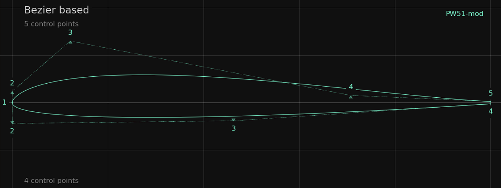

# Worker Tool
{: .no_toc }

The Worker is a command line tool for various tasks related to airfoil modification and polar generation.
{: .fs-6 .fw-300 }

Typically it is called within a batch script to automate repeating tasks such as setting flap positions and calculating polars for flapped airfoils. The tool uses the same internal functions as Xoptfoil2, so results are identical to those produced during optimization.

The basic format of a Worker call is like: 

```
   worker -w <worker_action> -a airfoil_file [options]
```

The additional `[options]` depend on the respective worker action described in the following sections. 

### Table of contents
{: .no_toc .text-delta }

1. TOC
{:toc}


---

## Repanel and normalize (-w norm)

The airfoil is [repaneled and normalized](#normalizing-the-coordinates) so that the leading edge is at (0, 0) and the trailing edge at (1, 0). The output airfoil has 7 decimal places in the `.dat` file.

The default number of coordinate points is 161. This value can be changed via the input file with the parameter `npan` in namelist `&paneling_options`.

   
| Argument                         | Usage     | Description                               |
|:---------------------------------|:----------|:------------------------------------------|
| <nobr>-w norm</nobr>             | mandatory | worker command   |
| <nobr>-a airfoil_file</nobr>     | mandatory | airfoil file  |
| <nobr>-i input_file</nobr>       | optional  | name of input file which holds the paneling options  |
| <nobr>-o output_prefix</nobr>    | optional  | Name of the normed airfoil `<output_prefix>.dat`.  If option -o is omitted, the name of the output file will be `<airfoil_name>_norm.dat`

The input file allows to define further paneling options:  

```fortran
&paneling_options                                ! options for re-paneling before optimization 
  npan             = 160                         ! no of panels of airfoil
  npoint           = 161                         ! alternative: number of coordinate points
  le_bunch         = 0.86                        ! panel bunch at leading edge  - 0..1 (max) 
  te_bunch         = 0.6                         ! panel bunch at trailing edge - 0..1 (max) 
/
``` 
{: .lh-tight }


#### Example <span>Windows</span>{: .label .label-blue }

The following batch script normalizes all airfoils whose names start with 'MH' in the current directory:

```
     dir MH*.dat /B > temp.txt
     for /f "delims=#" %%f in (temp.txt) do (
        worker -w norm -a "%%f"
     )
     del temp.txt
```
{: .lh-tight }


---

## Set flap (-w flap)

The flap is set to a defined angle after the airfoil was repaneled and normalized.
If more than one flap angle is defined several airfoils will be generated having the flap angle as part of the airfoil name.

   
| Argument                         | Usage     | Description                               |
|:---------------------------------|:----------|:------------------------------------------|
| <nobr>-w flap</nobr>             | mandatory | Worker command   |
| <nobr>-a airfoil_file</nobr>     | mandatory | airfoil file  |
| <nobr>-i input_file</nobr>       | mandatory | name of input file which holds the flap parameters  |
| <nobr>-o output_prefix</nobr>    | optional  | Name of the flapped airfoil `<output_prefix>_f<angle>.dat`. If option -o is omitted, the name of the output file will be `<airfoil_name>__f<angle>.dat`


The flap parameters are defined via the input file: 

```fortran
&operating_conditions                            ! options to describe the optimization task
  x_flap                 = 0.75                  ! chord position of flap 
  y_flap                 = 0.0                   ! vertical hinge position 
  y_flap_spec            = 'y/c'                 ! ... in chord unit or 'y/t' relative to height
  flap_angle             = 0.0                   ! list of flap angles to be applied
``` 
{: .lh-tight }


#### Example

The following Worker command will generate 5 airfoils having the defined flap angles.

```
worker -w flap -i flap.inp -a RG15.dat 
```

with the input file 'flap.inp':

```fortran
&operating_conditions                             
  x_flap             = 0.75                     ! chord position of flap 
  flap_angle         = 2, 4, 6, 8, 10           ! list of flap angles to be set
/
```
{: .lh-tight }


---

## Set geometry (-w set)

The 'set' command allows the modification of an airfoils geometry parameter:
- thickness and location of maximum thickness, 
- camber and location of maximum camber,
- trailing edge thickness 

   
| Argument                         | Usage     | Description                               |
|:---------------------------------|:----------|:------------------------------------------|
| <nobr>-w set \<parameter\> </nobr>  | mandatory | Worker command - \<parameter\> defines the modification which should be applied to the airfoil:   |
| <nobr>-a airfoil_file</nobr>     | mandatory | airfoil file  |
| <nobr>-i input_file</nobr>       | optional | name of input file which holds the optional paneling parameters  |
| <nobr>-o output_prefix</nobr>    | optional  | name of the created airfoil `<output_prefix>_<parameter>.dat`. If option -o is omitted, the name of the output file will be `<airfoil_name>_<parameter>.dat`

The \<parameter\> may have these values:

| \<parameter\>               |  Description                              |
|:----------------------------|:------------------------------------------|
| <nobr>t=yy</nobr>           | Set thickness to xx% |
| <nobr>xt=xx</nobr>          | Set location of maximum thickness to xx% of chord |
| <nobr>c=yy</nobr>           | Set camber to xx% |
| <nobr>xc=xx</nobr>          | Set location of maximum camber to xx% of chord |
| <nobr>te=yy</nobr>          |Set trailing edge gap to xx% of chord |


#### Example


```
worker -w set t=8.5 -a RG15.dat 
```

... will set the thickness of airfoil RG15 to 8.5%. The new file will be `RG15_t8.5.dat`. 


---

## Match Bezier (-w bezier)

Two Bezier curves - one for the upper, one for the lower side - are matched to the airfoil to create a new, smoothed airfoil.

For this, an optimization run is started, which uses a Simplex (Nelder-Mead) optimization to find a Bezier curve which matches as closely as possible the original '.dat' airfoil. 

During this 'match-foil' optimization, particular attention is paid to the curvature of the leading and trailing edges in order to obtain a geometrically clean seed airfoil for the subsequent main optimization.

When an input file with curvature settings is provided, the matching process also respects curvature controls such as `auto_curvature`, `check_le_curvature`, and `check_curvature_bumps`.

As a result, 2 airfoils are generated:
- a normal '.dat' file of the Bezier matched airfoil 
- a '.bez' file containing the control points of the Bezier curves. 

Both file types can be visualized with the app [Airfoil Editor](https://github.com/jxjo/AirfoilEditor) as shown below



 See chapter [Bezier shape function](#bezier_shape_function) for more information on Bezier based airfoils. 

   
| Argument                         | Usage     | Description                               |
|:---------------------------------|:----------|:------------------------------------------|
| <nobr>-w bezier </nobr>          | mandatory | Worker command  |
| <nobr>-a airfoil_file</nobr>     | mandatory | airfoil file to match with Bezier curves |
| <nobr>-i input_file</nobr>       | optional  | parameters of the Bezier curves for upper and lower side  |
| <nobr>-o output_prefix</nobr>    | optional  | name of the created airfoil `<output_prefix>.dat`. If option -o is omitted, the name of the output file will be `<airfoil_name>-bezier.dat`

The Bezier parameters are defined via the input file: 

```fortran
&bezier_options                                  ! options for shape_function 'bezier'
  ncp_top          = 5                           ! no of bezier control points on top side              
  ncp_bot          = 5                           ! no of bezier control points on bot side
/

&paneling_options                                ! options for re-paneling before optimization 
  npan             = 160                         ! no of panels of airfoil
  npoint           = 161                         ! alternative: number of coordinate points
  le_bunch         = 0.86                        ! panel bunch at leading edge  - 0..1 (max) 
  te_bunch         = 0.6                         ! panel bunch at trailing edge - 0..1 (max) 
/
``` 
{: .lh-tight }


#### Example <span>Windows</span>{: .label .label-blue }

The following batch script creates a Bezier-matched airfoil for each `.dat` file in the current directory,
using the default of 6 Bezier control points per side.

```
@echo off
dir *.dat /B /O > temp.txt
for /f "delims=#" %%f in (temp.txt) do (
  worker -w bezier  -a "%%f" 
)
del temp.txt
```
{: .lh-tight }


---

## Match B-Spline (-w bspline)

Two B-Spline curves - one for the upper, one for the lower side - are matched to the airfoil to create a new, smoothed airfoil.

The B-Spline is of degree 4 with uniform knots.

For this, an optimization run is started, which uses a Simplex (Nelder-Mead) optimization to find a B-Spline curve which matches as closely as possible the original '.dat' airfoil. 

During this 'match-foil' optimization, particular attention is paid to the curvature being smooth without bumps and no trailing edge artefacts in order to obtain a geometrically clean seed airfoil for the subsequent main optimization.

When an input file with curvature settings is provided, the matching process also respects curvature controls such as `auto_curvature`, `check_le_curvature`, and `check_curvature_bumps`.

As a result, 2 airfoils are generated:
- a normal '.dat' file of the B-Spline matched airfoil 
- a '.bsp' file containing the control points of the B-Spline curves. 

Both file types can be visualized with the app [Airfoil Editor](https://github.com/jxjo/AirfoilEditor) 

   
| Argument                         | Usage     | Description                               |
|:---------------------------------|:----------|:------------------------------------------|
| <nobr>-w bspline </nobr>         | mandatory | Worker command  |
| <nobr>-a airfoil_file</nobr>     | mandatory | airfoil file to match with B-Spline curves |
| <nobr>-i input_file</nobr>       | optional  | parameters of the B-Spline curves for upper and lower side  |
| <nobr>-o output_prefix</nobr>    | optional  | name of the created airfoil `<output_prefix>.dat`. If option -o is omitted, the name of the output file will be `<airfoil_name>-bspline.dat`

The B-Spline parameters are defined via the input file: 

```fortran
&bspline_options                                 ! options for shape_function 'bspline'
  ncp_top          = 6                           ! no of bspline control points on top side              
  ncp_bot          = 6                           ! no of bspline control points on bot side
/

&paneling_options                                ! options for re-paneling before optimization 
  npan             = 160                         ! no of panels of airfoil
  npoint           = 161                         ! alternative: number of coordinate points
  le_bunch         = 0.86                        ! panel bunch at leading edge  - 0..1 (max) 
  te_bunch         = 0.6                         ! panel bunch at trailing edge - 0..1 (max) 
/
``` 
{: .lh-tight }


#### Example <span>Windows</span>{: .label .label-blue }

The following batch script creates a B-Spline-matched airfoil for each `.dat` file in the current directory.

```
@echo off
dir *.dat /B /O > temp.txt
for /f "delims=#" %%f in (temp.txt) do (
  worker -w bspline  -a "%%f" 
)
del temp.txt
```
{: .lh-tight }


---

## Generate polars  (-w polar)

Polars of an airfoil will be generated in Xfoils polar format. The generated polar file is ready to be imported into xflr5 or flow5 via the menu function `Polars / Import Xfoil Polar(s)`.

Polar generation and flap setting can be combined in a single step: the input file accepts a list of flap angles, and polars are generated automatically for each angle.

The polars will be generated in the subdirectory `<airfoil_file>_polars` of the current directory.

The older `-w polar-flapped` command is deprecated. Use `-w polar` for both standard and flap-sweep polar generation.
   
| Argument                         | Usage     | Description                               |
|:---------------------------------|:----------|:------------------------------------------|
| <nobr>-w polar</nobr>            | mandatory | Worker command   |
| <nobr>-a airfoil_file</nobr>     | mandatory | airfoil file  |
| <nobr>-i input_file</nobr>       | mandatory | name of input file which holds the parameters for polar generation  |
| <nobr>-o output_prefix</nobr>    | optional  | Alternative file name `<output_prefix>.csv` |


The polar itself is defined via the input file: 

```fortran
&polar_generation                                ! options only for Worker   
  polar_reynolds   = 0                           ! list of reynolds like 100000, 200000, 600000
  polar_mach       = 0                           ! list of mach like 0.1, 0.2, 0.5
  type_of_polar    = 1                           ! either Type 1 or Type 2 polar 
  auto_range       = .false.                     ! best values for mode and range automatically set
  op_mode          = 'spec-al'                   ! range based on alpha or cl 
  op_point_range   = -2, 10, 0.25                ! range start, end, delta 
/

&xfoil_run_options
  ncrit            = 7                           ! ncrit default value for op points 
  xtript           = 1.0                         ! forced transition point 0..1 - top  
  xtripb           = 1.0                         ! forced transition point 0..1 - bot  
  detect_bubble    = .false.                     ! size of bubble for top and bot is appended in polar file
  vaccel           = 0.005                       ! xfoil vaccel parameter
/

&operating_conditions                            ! options to describe the optimization task
  x_flap                 = 0.75                  ! chord position of flap 
  y_flap                 = 0.0                   ! vertical hinge position 
  y_flap_spec            = 'y/c'                 ! ... in chord unit or 'y/t' relative to height
  flap_angle             = 0.0                   ! list of flap angles to be set
``` 
{: .lh-tight }

#### Example

The following Worker command will generate a set of T1 polars for the RG15 airfoil.
The alpha range is automatically determined to include the positive cl-max and negative cl-min regions.

Polar generation covers 4 flap angles, resulting in 5 × 4 polars generated in parallel using multithreading.

Laminar-turbulent transition is controlled by ncrit=7.

```
worker -w polar -i polars.inp  -a RG15.dat 
```

with the input file 'polars.inp':

```fortran
&polar_generation
  polar_reynolds     = 20000, 50000, 100000, 200000, 500000
  type_of_polar      = 1                        ! T1 polar 
  auto_range         = .true.                   ! auto values for mode and range
/
&operating_conditions                             
  x_flap             = 0.75                     ! chord position of flap 
  flap_angle         = -1.0, 0.0, 2.0, 4.0      ! list of flap angles to be set
/
&xfoil_run_options
  ncrit              = 7                        ! xfoils ncrit value                          
/
```
{: .lh-tight }
